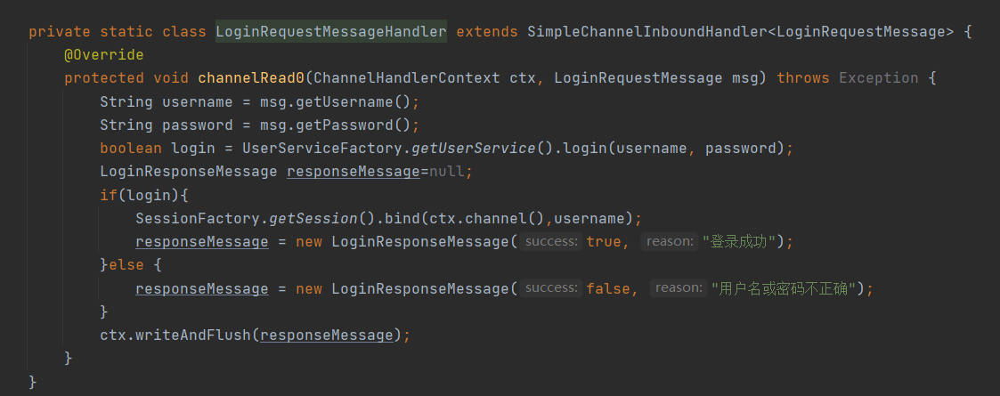

# 三. Netty 进阶

## 1. 粘包与半包

### 1.1 粘包现象

服务端代码

```java
public class HelloWorldServer {
    static final Logger log = LoggerFactory.getLogger(HelloWorldServer.class);
    void start() {
        NioEventLoopGroup boss = new NioEventLoopGroup(1);
        NioEventLoopGroup worker = new NioEventLoopGroup();
        try {
            ServerBootstrap serverBootstrap = new ServerBootstrap();
            serverBootstrap.channel(NioServerSocketChannel.class);
            serverBootstrap.group(boss, worker);
            serverBootstrap.childHandler(new ChannelInitializer<SocketChannel>() {
                @Override
                protected void initChannel(SocketChannel ch) throws Exception {
                    ch.pipeline().addLast(new LoggingHandler(LogLevel.DEBUG));
                    ch.pipeline().addLast(new ChannelInboundHandlerAdapter() {
                        @Override
                        public void channelActive(ChannelHandlerContext ctx) throws Exception {
                            log.debug("connected {}", ctx.channel());
                            super.channelActive(ctx);
                        }

                        @Override
                        public void channelInactive(ChannelHandlerContext ctx) throws Exception {
                            log.debug("disconnect {}", ctx.channel());
                            super.channelInactive(ctx);
                        }
                    });
                }
            });
            ChannelFuture channelFuture = serverBootstrap.bind(8080);
            log.debug("{} binding...", channelFuture.channel());
            channelFuture.sync();
            log.debug("{} bound...", channelFuture.channel());
            channelFuture.channel().closeFuture().sync();
        } catch (InterruptedException e) {
            log.error("server error", e);
        } finally {
            boss.shutdownGracefully();
            worker.shutdownGracefully();
            log.debug("stoped");
        }
    }

    public static void main(String[] args) {
        new HelloWorldServer().start();
    }
}
```

客户端代码希望发送 10 个消息，每个消息是 16 字节

```java
public class HelloWorldClient {
    static final Logger log = LoggerFactory.getLogger(HelloWorldClient.class);
    public static void main(String[] args) {
        NioEventLoopGroup worker = new NioEventLoopGroup();
        try {
            Bootstrap bootstrap = new Bootstrap();
            bootstrap.channel(NioSocketChannel.class);
            bootstrap.group(worker);
            bootstrap.handler(new ChannelInitializer<SocketChannel>() {
                @Override
                protected void initChannel(SocketChannel ch) throws Exception {
                    log.debug("connetted...");
                    ch.pipeline().addLast(new ChannelInboundHandlerAdapter() {
                        @Override//连接建立好之后触发
                        public void channelActive(ChannelHandlerContext ctx) throws Exception {
                            log.debug("sending...");
                            Random r = new Random();
                            char c = 'a';
                            for (int i = 0; i < 10; i++) {
                                ByteBuf buffer = ctx.alloc().buffer();
                                buffer.writeBytes(new byte[]{0, 1, 2, 3, 4, 5, 6, 7, 8, 9, 10, 11, 12, 13, 14, 15});
                                ctx.writeAndFlush(buffer);
                            }
                        }
                    });
                }
            });
            ChannelFuture channelFuture = bootstrap.connect("127.0.0.1", 8080).sync();
            channelFuture.channel().closeFuture().sync();

        } catch (InterruptedException e) {
            log.error("client error", e);
        } finally {
            worker.shutdownGracefully();
        }
    }
}
```

服务器端的某次输出，可以看到一次就接收了 160 个字节，而非分 10 次接收

```
08:24:46 [DEBUG] [main] c.i.n.HelloWorldServer - [id: 0x81e0fda5] binding...
08:24:46 [DEBUG] [main] c.i.n.HelloWorldServer - [id: 0x81e0fda5, L:/0:0:0:0:0:0:0:0:8080] bound...
08:24:55 [DEBUG] [nioEventLoopGroup-3-1] i.n.h.l.LoggingHandler - [id: 0x94132411, L:/127.0.0.1:8080 - R:/127.0.0.1:58177] REGISTERED
08:24:55 [DEBUG] [nioEventLoopGroup-3-1] i.n.h.l.LoggingHandler - [id: 0x94132411, L:/127.0.0.1:8080 - R:/127.0.0.1:58177] ACTIVE
08:24:55 [DEBUG] [nioEventLoopGroup-3-1] c.i.n.HelloWorldServer - connected [id: 0x94132411, L:/127.0.0.1:8080 - R:/127.0.0.1:58177]
08:24:55 [DEBUG] [nioEventLoopGroup-3-1] i.n.h.l.LoggingHandler - [id: 0x94132411, L:/127.0.0.1:8080 - R:/127.0.0.1:58177] READ: 160B
         +-------------------------------------------------+
         |  0  1  2  3  4  5  6  7  8  9  a  b  c  d  e  f |
+--------+-------------------------------------------------+----------------+
|00000000| 00 01 02 03 04 05 06 07 08 09 0a 0b 0c 0d 0e 0f |................|
|00000010| 00 01 02 03 04 05 06 07 08 09 0a 0b 0c 0d 0e 0f |................|
|00000020| 00 01 02 03 04 05 06 07 08 09 0a 0b 0c 0d 0e 0f |................|
|00000030| 00 01 02 03 04 05 06 07 08 09 0a 0b 0c 0d 0e 0f |................|
|00000040| 00 01 02 03 04 05 06 07 08 09 0a 0b 0c 0d 0e 0f |................|
|00000050| 00 01 02 03 04 05 06 07 08 09 0a 0b 0c 0d 0e 0f |................|
|00000060| 00 01 02 03 04 05 06 07 08 09 0a 0b 0c 0d 0e 0f |................|
|00000070| 00 01 02 03 04 05 06 07 08 09 0a 0b 0c 0d 0e 0f |................|
|00000080| 00 01 02 03 04 05 06 07 08 09 0a 0b 0c 0d 0e 0f |................|
|00000090| 00 01 02 03 04 05 06 07 08 09 0a 0b 0c 0d 0e 0f |................|
+--------+-------------------------------------------------+----------------+
08:24:55 [DEBUG] [nioEventLoopGroup-3-1] i.n.h.l.LoggingHandler - [id: 0x94132411, L:/127.0.0.1:8080 - R:/127.0.0.1:58177] READ COMPLETE
```


### 1.2 半包现象

客户端代码希望发送 1 个消息，这个消息是 160 字节，代码改为

```java
ByteBuf buffer = ctx.alloc().buffer();
for (int i = 0; i < 10; i++) {
    buffer.writeBytes(new byte[]{0, 1, 2, 3, 4, 5, 6, 7, 8, 9, 10, 11, 12, 13, 14, 15});
}
ctx.writeAndFlush(buffer);
```

为现象明显，服务端修改一下接收缓冲区，其它代码不变

```java
serverBootstrap.option(ChannelOption.SO_RCVBUF, 10);
```

服务器端的某次输出，可以看到接收的消息被分为两节，第一次 20 字节，第二次 140 字节

```
08:43:49 [DEBUG] [main] c.i.n.HelloWorldServer - [id: 0x4d6c6a84] binding...
08:43:49 [DEBUG] [main] c.i.n.HelloWorldServer - [id: 0x4d6c6a84, L:/0:0:0:0:0:0:0:0:8080] bound...
08:44:23 [DEBUG] [nioEventLoopGroup-3-1] i.n.h.l.LoggingHandler - [id: 0x1719abf7, L:/127.0.0.1:8080 - R:/127.0.0.1:59221] REGISTERED
08:44:23 [DEBUG] [nioEventLoopGroup-3-1] i.n.h.l.LoggingHandler - [id: 0x1719abf7, L:/127.0.0.1:8080 - R:/127.0.0.1:59221] ACTIVE
08:44:23 [DEBUG] [nioEventLoopGroup-3-1] c.i.n.HelloWorldServer - connected [id: 0x1719abf7, L:/127.0.0.1:8080 - R:/127.0.0.1:59221]
08:44:24 [DEBUG] [nioEventLoopGroup-3-1] i.n.h.l.LoggingHandler - [id: 0x1719abf7, L:/127.0.0.1:8080 - R:/127.0.0.1:59221] READ: 20B
         +-------------------------------------------------+
         |  0  1  2  3  4  5  6  7  8  9  a  b  c  d  e  f |
+--------+-------------------------------------------------+----------------+
|00000000| 00 01 02 03 04 05 06 07 08 09 0a 0b 0c 0d 0e 0f |................|
|00000010| 00 01 02 03                                     |....            |
+--------+-------------------------------------------------+----------------+
08:44:24 [DEBUG] [nioEventLoopGroup-3-1] i.n.h.l.LoggingHandler - [id: 0x1719abf7, L:/127.0.0.1:8080 - R:/127.0.0.1:59221] READ COMPLETE
08:44:24 [DEBUG] [nioEventLoopGroup-3-1] i.n.h.l.LoggingHandler - [id: 0x1719abf7, L:/127.0.0.1:8080 - R:/127.0.0.1:59221] READ: 140B
         +-------------------------------------------------+
         |  0  1  2  3  4  5  6  7  8  9  a  b  c  d  e  f |
+--------+-------------------------------------------------+----------------+
|00000000| 04 05 06 07 08 09 0a 0b 0c 0d 0e 0f 00 01 02 03 |................|
|00000010| 04 05 06 07 08 09 0a 0b 0c 0d 0e 0f 00 01 02 03 |................|
|00000020| 04 05 06 07 08 09 0a 0b 0c 0d 0e 0f 00 01 02 03 |................|
|00000030| 04 05 06 07 08 09 0a 0b 0c 0d 0e 0f 00 01 02 03 |................|
|00000040| 04 05 06 07 08 09 0a 0b 0c 0d 0e 0f 00 01 02 03 |................|
|00000050| 04 05 06 07 08 09 0a 0b 0c 0d 0e 0f 00 01 02 03 |................|
|00000060| 04 05 06 07 08 09 0a 0b 0c 0d 0e 0f 00 01 02 03 |................|
|00000070| 04 05 06 07 08 09 0a 0b 0c 0d 0e 0f 00 01 02 03 |................|
|00000080| 04 05 06 07 08 09 0a 0b 0c 0d 0e 0f             |............    |
+--------+-------------------------------------------------+----------------+
08:44:24 [DEBUG] [nioEventLoopGroup-3-1] i.n.h.l.LoggingHandler - [id: 0x1719abf7, L:/127.0.0.1:8080 - R:/127.0.0.1:59221] READ COMPLETE
```

> **注意**
>
> serverBootstrap.option(ChannelOption.SO_RCVBUF, 10) 影响的底层接收缓冲区（即滑动窗口）大小，仅决定了 netty 读取的最小单位，netty 实际每次读取的一般是它的整数倍


### 1.3 现象分析

#### 粘包

* 现象，发送 abc def，接收 abcdef
* 原因
  * 应用层：接收方 ByteBuf 设置太大（Netty 默认 1024）
  * 滑动窗口：假设发送方 256 bytes 表示一个完整报文，**但由于接收方处理不及时且窗口大小足够大**，这 256 bytes 字节就会缓冲在接收方的滑动窗口中，当滑动窗口中缓冲了多个报文就会粘包
  * Nagle 算法：会造成粘包

#### 半包

* 现象，发送 abcdef，接收 abc def
* 原因
  * 应用层：接收方 ByteBuf 小于实际发送数据量
  * 滑动窗口：假设接收方的窗口只剩了 128 bytes，发送方的报文大小是 256 bytes，这时放不下了，只能先发送前 128 bytes，等待 ack 后才能发送剩余部分，这就造成了半包
  * MSS 限制：当发送的数据超过 MSS 限制后，会将数据切分发送，就会造成半包


本质是因为 TCP 是流式协议，消息无边界


#### 滑动窗口
>
> * TCP 以一个段（segment）为单位，每发送一个段就需要进行一次确认应答（ack）处理，但如果这么做，缺点是包的往返时间越长性能就越差
>
>   
>
> 
>
> * 为了解决此问题，引入了窗口概念，窗口大小即决定了无需等待应答而可以继续发送的数据最大值
>
>   
>
>
> * 窗口实际就起到一个缓冲区的作用，同时也能起到流量控制的作用
>
>   * 图中深色的部分即要发送的数据，高亮的部分即窗口
>   * 窗口内的数据才允许被发送，当应答未到达前，窗口必须停止滑动
>   * 如果 1001~2000 这个段的数据 ack 回来了，窗口就可以向前滑动
>   * 接收方也会维护一个窗口，只有落在窗口内的数据才能允许接收
>   
>   
>


#### MSS 限制
>
>  * 链路层对一次能够发送的最大数据有限制，这个限制称之为 MTU（maximum transmission unit），不同的链路设备的 MTU 值也有所不同，例如
>
>   * 以太网的 MTU 是 1500
>   * FDDI（光纤分布式数据接口）的 MTU 是 4352
>   * 本地回环地址的 MTU 是 65535 - 本地测试不走网卡
>
>  * MSS 是最大段长度（maximum segment size），它是 MTU 刨去 tcp 头和 ip 头后剩余能够作为数据传输的字节数
>
>   * ipv4 tcp 头占用 20 bytes，ip 头占用 20 bytes，因此以太网 MSS 的值为 1500 - 40 = 1460
>   * TCP 在传递大量数据时，会按照 MSS 大小将数据进行分割发送
>   * MSS 的值在三次握手时通知对方自己 MSS 的值，然后在两者之间选择一个小值作为 MSS
>
>   


#### Nagle 算法
>
> * 即使发送一个字节，也需要加入 tcp 头和 ip 头，也就是总字节数会使用 41 bytes，非常不经济。因此为了提高网络利用率，tcp 希望尽可能发送足够大的数据，这就是 Nagle 算法产生的缘由
> * 该算法是指发送端即使还有应该发送的数据，但如果这部分数据很少的话，则进行延迟发送
>   * 如果 SO_SNDBUF 的数据达到 MSS，则需要发送
>   * 如果 SO_SNDBUF 中含有 FIN（表示需要连接关闭）这时将剩余数据发送，再关闭
>   * 如果 TCP_NODELAY = true，则需要发送
>   * 已发送的数据都收到 ack 时，则需要发送
>   * 上述条件不满足，但发生超时（一般为 200ms）则需要发送
>   * 除上述情况，延迟发送


### 1.4 解决方案

1. 短链接，发一个包建立一次连接，这样连接建立到连接断开之间就是消息的边界，缺点效率太低
2. 每一条消息采用固定长度，缺点浪费空间(服务端和客户端商量好)
3. 每一条消息采用分隔符，例如 \n，缺点需要转义
4. 每一条消息分为 head 和 body，head 中包含 body 的长度


#### 方法1，短链接

以解决粘包为例

```java
public class HelloWorldClient {
    static final Logger log = LoggerFactory.getLogger(HelloWorldClient.class);

    public static void main(String[] args) {
        // 分 10 次发送
        for (int i = 0; i < 10; i++) {
            send();
        }
    }

    private static void send() {
        NioEventLoopGroup worker = new NioEventLoopGroup();
        try {
            Bootstrap bootstrap = new Bootstrap();
            bootstrap.channel(NioSocketChannel.class);
            bootstrap.group(worker);
            bootstrap.handler(new ChannelInitializer<SocketChannel>() {
                @Override
                protected void initChannel(SocketChannel ch) throws Exception {
                    log.debug("conneted...");
                    ch.pipeline().addLast(new LoggingHandler(LogLevel.DEBUG));
                    ch.pipeline().addLast(new ChannelInboundHandlerAdapter() {
                        @Override
                        public void channelActive(ChannelHandlerContext ctx) throws Exception {
                            log.debug("sending...");
                            ByteBuf buffer = ctx.alloc().buffer();
                            buffer.writeBytes(new byte[]{0, 1, 2, 3, 4, 5, 6, 7, 8, 9, 10, 11, 12, 13, 14, 15});
                            ctx.writeAndFlush(buffer);
                            // 发完即关
                            ctx.close();//ctx.close()会触发当前Handler和当前Handler之前的close事件,ctx.channel.close()所有Handler都会触发
                        }
                    });
                }
            });
            ChannelFuture channelFuture = bootstrap.connect("localhost", 8080).sync();
            channelFuture.channel().closeFuture().sync();

        } catch (InterruptedException e) {
            log.error("client error", e);
        } finally {
            worker.shutdownGracefully();
        }
    }
}
```

输出，略

> 半包用这种办法还是不好解决，因为接收方的缓冲区大小是有限的


#### 方法2，固定长度

让所有数据包长度固定（假设长度为 8 字节），服务器端加入

```java
ch.pipeline().addLast(new FixedLengthFrameDecoder(8));//写在LoggingHandler之前，否则不管用
```

客户端测试代码，注意, 采用这种方法后，客户端什么时候 flush 都可以

```java
public class HelloWorldClient {
    static final Logger log = LoggerFactory.getLogger(HelloWorldClient.class);

    public static void main(String[] args) {
        NioEventLoopGroup worker = new NioEventLoopGroup();
        try {
            Bootstrap bootstrap = new Bootstrap();
            bootstrap.channel(NioSocketChannel.class);
            bootstrap.group(worker);
            bootstrap.handler(new ChannelInitializer<SocketChannel>() {
                @Override
                protected void initChannel(SocketChannel ch) throws Exception {
                    log.debug("connetted...");
                    ch.pipeline().addLast(new LoggingHandler(LogLevel.DEBUG));
                    ch.pipeline().addLast(new ChannelInboundHandlerAdapter() {
                        @Override
                        public void channelActive(ChannelHandlerContext ctx) throws Exception {
                            log.debug("sending...");
                            // 发送内容随机的数据包
                            Random r = new Random();
                            char c = 'a';
                            ByteBuf buffer = ctx.alloc().buffer();
                            for (int i = 0; i < 10; i++) {
                                byte[] bytes = new byte[8];
                                for (int j = 0; j < r.nextInt(8); j++) {
                                    bytes[j] = (byte) c;
                                }
                                c++;
                                buffer.writeBytes(bytes);
                            }
                            ctx.writeAndFlush(buffer);
                        }
                    });
                }
            });
            ChannelFuture channelFuture = bootstrap.connect("127.0.0.1", 8080).sync();
            channelFuture.channel().closeFuture().sync();

        } catch (InterruptedException e) {
            log.error("client error", e);
        } finally {
            worker.shutdownGracefully();
        }
    }
}
```

客户端输出

```
12:07:00 [DEBUG] [nioEventLoopGroup-2-1] c.i.n.HelloWorldClient - connetted...
12:07:00 [DEBUG] [nioEventLoopGroup-2-1] i.n.h.l.LoggingHandler - [id: 0x3c2ef3c2] REGISTERED
12:07:00 [DEBUG] [nioEventLoopGroup-2-1] i.n.h.l.LoggingHandler - [id: 0x3c2ef3c2] CONNECT: /192.168.0.103:9090
12:07:00 [DEBUG] [nioEventLoopGroup-2-1] i.n.h.l.LoggingHandler - [id: 0x3c2ef3c2, L:/192.168.0.103:53155 - R:/192.168.0.103:9090] ACTIVE
12:07:00 [DEBUG] [nioEventLoopGroup-2-1] c.i.n.HelloWorldClient - sending...
12:07:00 [DEBUG] [nioEventLoopGroup-2-1] i.n.h.l.LoggingHandler - [id: 0x3c2ef3c2, L:/192.168.0.103:53155 - R:/192.168.0.103:9090] WRITE: 80B
         +-------------------------------------------------+
         |  0  1  2  3  4  5  6  7  8  9  a  b  c  d  e  f |
+--------+-------------------------------------------------+----------------+
|00000000| 61 61 61 61 00 00 00 00 62 00 00 00 00 00 00 00 |aaaa....b.......|
|00000010| 63 63 00 00 00 00 00 00 64 00 00 00 00 00 00 00 |cc......d.......|
|00000020| 00 00 00 00 00 00 00 00 66 66 66 66 00 00 00 00 |........ffff....|
|00000030| 67 67 67 00 00 00 00 00 68 00 00 00 00 00 00 00 |ggg.....h.......|
|00000040| 69 69 69 69 69 00 00 00 6a 6a 6a 6a 00 00 00 00 |iiiii...jjjj....|
+--------+-------------------------------------------------+----------------+
12:07:00 [DEBUG] [nioEventLoopGroup-2-1] i.n.h.l.LoggingHandler - [id: 0x3c2ef3c2, L:/192.168.0.103:53155 - R:/192.168.0.103:9090] FLUSH
```

服务端输出

```
12:06:51 [DEBUG] [main] c.i.n.HelloWorldServer - [id: 0xe3d9713f] binding...
12:06:51 [DEBUG] [main] c.i.n.HelloWorldServer - [id: 0xe3d9713f, L:/192.168.0.103:9090] bound...
12:07:00 [DEBUG] [nioEventLoopGroup-3-1] i.n.h.l.LoggingHandler - [id: 0xd739f137, L:/192.168.0.103:9090 - R:/192.168.0.103:53155] REGISTERED
12:07:00 [DEBUG] [nioEventLoopGroup-3-1] i.n.h.l.LoggingHandler - [id: 0xd739f137, L:/192.168.0.103:9090 - R:/192.168.0.103:53155] ACTIVE
12:07:00 [DEBUG] [nioEventLoopGroup-3-1] c.i.n.HelloWorldServer - connected [id: 0xd739f137, L:/192.168.0.103:9090 - R:/192.168.0.103:53155]
12:07:00 [DEBUG] [nioEventLoopGroup-3-1] i.n.h.l.LoggingHandler - [id: 0xd739f137, L:/192.168.0.103:9090 - R:/192.168.0.103:53155] READ: 8B
         +-------------------------------------------------+
         |  0  1  2  3  4  5  6  7  8  9  a  b  c  d  e  f |
+--------+-------------------------------------------------+----------------+
|00000000| 61 61 61 61 00 00 00 00                         |aaaa....        |
+--------+-------------------------------------------------+----------------+
12:07:00 [DEBUG] [nioEventLoopGroup-3-1] i.n.h.l.LoggingHandler - [id: 0xd739f137, L:/192.168.0.103:9090 - R:/192.168.0.103:53155] READ: 8B
         +-------------------------------------------------+
         |  0  1  2  3  4  5  6  7  8  9  a  b  c  d  e  f |
+--------+-------------------------------------------------+----------------+
|00000000| 62 00 00 00 00 00 00 00                         |b.......        |
+--------+-------------------------------------------------+----------------+
12:07:00 [DEBUG] [nioEventLoopGroup-3-1] i.n.h.l.LoggingHandler - [id: 0xd739f137, L:/192.168.0.103:9090 - R:/192.168.0.103:53155] READ: 8B
         +-------------------------------------------------+
         |  0  1  2  3  4  5  6  7  8  9  a  b  c  d  e  f |
+--------+-------------------------------------------------+----------------+
|00000000| 63 63 00 00 00 00 00 00                         |cc......        |
+--------+-------------------------------------------------+----------------+
12:07:00 [DEBUG] [nioEventLoopGroup-3-1] i.n.h.l.LoggingHandler - [id: 0xd739f137, L:/192.168.0.103:9090 - R:/192.168.0.103:53155] READ: 8B
         +-------------------------------------------------+
         |  0  1  2  3  4  5  6  7  8  9  a  b  c  d  e  f |
+--------+-------------------------------------------------+----------------+
|00000000| 64 00 00 00 00 00 00 00                         |d.......        |
+--------+-------------------------------------------------+----------------+
12:07:00 [DEBUG] [nioEventLoopGroup-3-1] i.n.h.l.LoggingHandler - [id: 0xd739f137, L:/192.168.0.103:9090 - R:/192.168.0.103:53155] READ: 8B
         +-------------------------------------------------+
         |  0  1  2  3  4  5  6  7  8  9  a  b  c  d  e  f |
+--------+-------------------------------------------------+----------------+
|00000000| 00 00 00 00 00 00 00 00                         |........        |
+--------+-------------------------------------------------+----------------+
12:07:00 [DEBUG] [nioEventLoopGroup-3-1] i.n.h.l.LoggingHandler - [id: 0xd739f137, L:/192.168.0.103:9090 - R:/192.168.0.103:53155] READ: 8B
         +-------------------------------------------------+
         |  0  1  2  3  4  5  6  7  8  9  a  b  c  d  e  f |
+--------+-------------------------------------------------+----------------+
|00000000| 66 66 66 66 00 00 00 00                         |ffff....        |
+--------+-------------------------------------------------+----------------+
12:07:00 [DEBUG] [nioEventLoopGroup-3-1] i.n.h.l.LoggingHandler - [id: 0xd739f137, L:/192.168.0.103:9090 - R:/192.168.0.103:53155] READ: 8B
         +-------------------------------------------------+
         |  0  1  2  3  4  5  6  7  8  9  a  b  c  d  e  f |
+--------+-------------------------------------------------+----------------+
|00000000| 67 67 67 00 00 00 00 00                         |ggg.....        |
+--------+-------------------------------------------------+----------------+
12:07:00 [DEBUG] [nioEventLoopGroup-3-1] i.n.h.l.LoggingHandler - [id: 0xd739f137, L:/192.168.0.103:9090 - R:/192.168.0.103:53155] READ: 8B
         +-------------------------------------------------+
         |  0  1  2  3  4  5  6  7  8  9  a  b  c  d  e  f |
+--------+-------------------------------------------------+----------------+
|00000000| 68 00 00 00 00 00 00 00                         |h.......        |
+--------+-------------------------------------------------+----------------+
12:07:00 [DEBUG] [nioEventLoopGroup-3-1] i.n.h.l.LoggingHandler - [id: 0xd739f137, L:/192.168.0.103:9090 - R:/192.168.0.103:53155] READ: 8B
         +-------------------------------------------------+
         |  0  1  2  3  4  5  6  7  8  9  a  b  c  d  e  f |
+--------+-------------------------------------------------+----------------+
|00000000| 69 69 69 69 69 00 00 00                         |iiiii...        |
+--------+-------------------------------------------------+----------------+
12:07:00 [DEBUG] [nioEventLoopGroup-3-1] i.n.h.l.LoggingHandler - [id: 0xd739f137, L:/192.168.0.103:9090 - R:/192.168.0.103:53155] READ: 8B
         +-------------------------------------------------+
         |  0  1  2  3  4  5  6  7  8  9  a  b  c  d  e  f |
+--------+-------------------------------------------------+----------------+
|00000000| 6a 6a 6a 6a 00 00 00 00                         |jjjj....        |
+--------+-------------------------------------------------+----------------+
12:07:00 [DEBUG] [nioEventLoopGroup-3-1] i.n.h.l.LoggingHandler - [id: 0xd739f137, L:/192.168.0.103:9090 - R:/192.168.0.103:53155] READ COMPLETE
```

缺点是，数据包的大小不好把握

* 长度定的太大，浪费
* 长度定的太小，对某些数据包又显得不够


#### 方法3，固定分隔符

服务端加入，默认以 \n 或 \r\n 作为分隔符，如果超出指定长度仍未出现分隔符，则抛出异常

```java
ch.pipeline().addLast(new LineBasedFrameDecoder(1024));//写在LoggingHandler之前，否则不管用
```

客户端在每条消息之后，加入 \n 分隔符

```java
public class HelloWorldClient {
    static final Logger log = LoggerFactory.getLogger(HelloWorldClient.class);

    public static void main(String[] args) {
        NioEventLoopGroup worker = new NioEventLoopGroup();
        try {
            Bootstrap bootstrap = new Bootstrap();
            bootstrap.channel(NioSocketChannel.class);
            bootstrap.group(worker);
            bootstrap.handler(new ChannelInitializer<SocketChannel>() {
                @Override
                protected void initChannel(SocketChannel ch) throws Exception {
                    log.debug("connected...");
                    ch.pipeline().addLast(new LoggingHandler(LogLevel.DEBUG));
                    ch.pipeline().addLast(new ChannelInboundHandlerAdapter() {
                        @Override
                        public void channelActive(ChannelHandlerContext ctx) throws Exception {
                            log.debug("sending...");
                            Random r = new Random();
                            char c = 'a';
                            ByteBuf buffer = ctx.alloc().buffer();
                            for (int i = 0; i < 10; i++) {
                                for (int j = 1; j <= r.nextInt(16)+1; j++) {
                                    buffer.writeByte((byte) c);
                                }
                                buffer.writeByte(10);
                                c++;
                            }
                            ctx.writeAndFlush(buffer);
                        }
                    });
                }
            });
            ChannelFuture channelFuture = bootstrap.connect("127.0.0.1", 8080).sync();
            channelFuture.channel().closeFuture().sync();

        } catch (InterruptedException e) {
            log.error("client error", e);
        } finally {
            worker.shutdownGracefully();
        }
    }
}
```

客户端输出

```
14:08:18 [DEBUG] [nioEventLoopGroup-2-1] c.i.n.HelloWorldClient - connetted...
14:08:18 [DEBUG] [nioEventLoopGroup-2-1] i.n.h.l.LoggingHandler - [id: 0x1282d755] REGISTERED
14:08:18 [DEBUG] [nioEventLoopGroup-2-1] i.n.h.l.LoggingHandler - [id: 0x1282d755] CONNECT: /192.168.0.103:9090
14:08:18 [DEBUG] [nioEventLoopGroup-2-1] i.n.h.l.LoggingHandler - [id: 0x1282d755, L:/192.168.0.103:63641 - R:/192.168.0.103:9090] ACTIVE
14:08:18 [DEBUG] [nioEventLoopGroup-2-1] c.i.n.HelloWorldClient - sending...
14:08:18 [DEBUG] [nioEventLoopGroup-2-1] i.n.h.l.LoggingHandler - [id: 0x1282d755, L:/192.168.0.103:63641 - R:/192.168.0.103:9090] WRITE: 60B
         +-------------------------------------------------+
         |  0  1  2  3  4  5  6  7  8  9  a  b  c  d  e  f |
+--------+-------------------------------------------------+----------------+
|00000000| 61 0a 62 62 62 0a 63 63 63 0a 64 64 0a 65 65 65 |a.bbb.ccc.dd.eee|
|00000010| 65 65 65 65 65 65 65 0a 66 66 0a 67 67 67 67 67 |eeeeeee.ff.ggggg|
|00000020| 67 67 0a 68 68 68 68 0a 69 69 69 69 69 69 69 0a |gg.hhhh.iiiiiii.|
|00000030| 6a 6a 6a 6a 6a 6a 6a 6a 6a 6a 6a 0a             |jjjjjjjjjjj.    |
+--------+-------------------------------------------------+----------------+
14:08:18 [DEBUG] [nioEventLoopGroup-2-1] i.n.h.l.LoggingHandler - [id: 0x1282d755, L:/192.168.0.103:63641 - R:/192.168.0.103:9090] FLUSH
```


服务端输出

```
14:08:18 [DEBUG] [nioEventLoopGroup-3-5] c.i.n.HelloWorldServer - connected [id: 0xa4b3be43, L:/192.168.0.103:9090 - R:/192.168.0.103:63641]
14:08:18 [DEBUG] [nioEventLoopGroup-3-5] i.n.h.l.LoggingHandler - [id: 0xa4b3be43, L:/192.168.0.103:9090 - R:/192.168.0.103:63641] READ: 1B
         +-------------------------------------------------+
         |  0  1  2  3  4  5  6  7  8  9  a  b  c  d  e  f |
+--------+-------------------------------------------------+----------------+
|00000000| 61                                              |a               |
+--------+-------------------------------------------------+----------------+
14:08:18 [DEBUG] [nioEventLoopGroup-3-5] i.n.h.l.LoggingHandler - [id: 0xa4b3be43, L:/192.168.0.103:9090 - R:/192.168.0.103:63641] READ: 3B
         +-------------------------------------------------+
         |  0  1  2  3  4  5  6  7  8  9  a  b  c  d  e  f |
+--------+-------------------------------------------------+----------------+
|00000000| 62 62 62                                        |bbb             |
+--------+-------------------------------------------------+----------------+
14:08:18 [DEBUG] [nioEventLoopGroup-3-5] i.n.h.l.LoggingHandler - [id: 0xa4b3be43, L:/192.168.0.103:9090 - R:/192.168.0.103:63641] READ: 3B
         +-------------------------------------------------+
         |  0  1  2  3  4  5  6  7  8  9  a  b  c  d  e  f |
+--------+-------------------------------------------------+----------------+
|00000000| 63 63 63                                        |ccc             |
+--------+-------------------------------------------------+----------------+
14:08:18 [DEBUG] [nioEventLoopGroup-3-5] i.n.h.l.LoggingHandler - [id: 0xa4b3be43, L:/192.168.0.103:9090 - R:/192.168.0.103:63641] READ: 2B
         +-------------------------------------------------+
         |  0  1  2  3  4  5  6  7  8  9  a  b  c  d  e  f |
+--------+-------------------------------------------------+----------------+
|00000000| 64 64                                           |dd              |
+--------+-------------------------------------------------+----------------+
14:08:18 [DEBUG] [nioEventLoopGroup-3-5] i.n.h.l.LoggingHandler - [id: 0xa4b3be43, L:/192.168.0.103:9090 - R:/192.168.0.103:63641] READ: 10B
         +-------------------------------------------------+
         |  0  1  2  3  4  5  6  7  8  9  a  b  c  d  e  f |
+--------+-------------------------------------------------+----------------+
|00000000| 65 65 65 65 65 65 65 65 65 65                   |eeeeeeeeee      |
+--------+-------------------------------------------------+----------------+
14:08:18 [DEBUG] [nioEventLoopGroup-3-5] i.n.h.l.LoggingHandler - [id: 0xa4b3be43, L:/192.168.0.103:9090 - R:/192.168.0.103:63641] READ: 2B
         +-------------------------------------------------+
         |  0  1  2  3  4  5  6  7  8  9  a  b  c  d  e  f |
+--------+-------------------------------------------------+----------------+
|00000000| 66 66                                           |ff              |
+--------+-------------------------------------------------+----------------+
14:08:18 [DEBUG] [nioEventLoopGroup-3-5] i.n.h.l.LoggingHandler - [id: 0xa4b3be43, L:/192.168.0.103:9090 - R:/192.168.0.103:63641] READ: 7B
         +-------------------------------------------------+
         |  0  1  2  3  4  5  6  7  8  9  a  b  c  d  e  f |
+--------+-------------------------------------------------+----------------+
|00000000| 67 67 67 67 67 67 67                            |ggggggg         |
+--------+-------------------------------------------------+----------------+
14:08:18 [DEBUG] [nioEventLoopGroup-3-5] i.n.h.l.LoggingHandler - [id: 0xa4b3be43, L:/192.168.0.103:9090 - R:/192.168.0.103:63641] READ: 4B
         +-------------------------------------------------+
         |  0  1  2  3  4  5  6  7  8  9  a  b  c  d  e  f |
+--------+-------------------------------------------------+----------------+
|00000000| 68 68 68 68                                     |hhhh            |
+--------+-------------------------------------------------+----------------+
14:08:18 [DEBUG] [nioEventLoopGroup-3-5] i.n.h.l.LoggingHandler - [id: 0xa4b3be43, L:/192.168.0.103:9090 - R:/192.168.0.103:63641] READ: 7B
         +-------------------------------------------------+
         |  0  1  2  3  4  5  6  7  8  9  a  b  c  d  e  f |
+--------+-------------------------------------------------+----------------+
|00000000| 69 69 69 69 69 69 69                            |iiiiiii         |
+--------+-------------------------------------------------+----------------+
14:08:18 [DEBUG] [nioEventLoopGroup-3-5] i.n.h.l.LoggingHandler - [id: 0xa4b3be43, L:/192.168.0.103:9090 - R:/192.168.0.103:63641] READ: 11B
         +-------------------------------------------------+
         |  0  1  2  3  4  5  6  7  8  9  a  b  c  d  e  f |
+--------+-------------------------------------------------+----------------+
|00000000| 6a 6a 6a 6a 6a 6a 6a 6a 6a 6a 6a                |jjjjjjjjjjj     |
+--------+-------------------------------------------------+----------------+
14:08:18 [DEBUG] [nioEventLoopGroup-3-5] i.n.h.l.LoggingHandler - [id: 0xa4b3be43, L:/192.168.0.103:9090 - R:/192.168.0.103:63641] READ COMPLETE
```

缺点，处理字符数据比较合适，但如果内容本身包含了分隔符（字节数据常常会有此情况），那么就会解析错误


#### 方法4，预设长度(LTC解码器，自定义协议)
不知道LTC是啥去看nio部分
在发送消息前，先约定用定长字节表示接下来数据的长度

```java
// 5个变量分别对应整个消息的最大长度，长度偏移，长度占用字节，长度调整，剥离字节数
//最大长度:顾名思义
//长度偏移:存储内容的长度的区域开头与整个消息的开头的距离(可能需要在开头存储其它信息)
//长度占用字节:存储内容的长度需要用的字节(即存储内容的长度所需的区域)
//长度调整:如果在内容的长度之后与内容之前，还需要存储内容之外的东西(如版本号)，这个东西要占的字节
//剥离字节数:表示要整个消息中要去掉的部分的字节数，删除从消息开头到剥离字节数的位置的信息，保留后面的部分，例如删除开头的其他信息和长度信息等等

//内容是规定存在消息的后面，起始位置为长度偏移+长度占用字节+长度调整，终止位置为起始位置加内容的长度
ch.pipeline().addLast(new LengthFieldBasedFrameDecoder(1024, 0, 1, 0, 1));//写在LoggingHandler之前，否则不管用
```

客户端代码

```java
public class HelloWorldClient {
    static final Logger log = LoggerFactory.getLogger(HelloWorldClient.class);

    public static void main(String[] args) {
        NioEventLoopGroup worker = new NioEventLoopGroup();
        try {
            Bootstrap bootstrap = new Bootstrap();
            bootstrap.channel(NioSocketChannel.class);
            bootstrap.group(worker);
            bootstrap.handler(new ChannelInitializer<SocketChannel>() {
                @Override
                protected void initChannel(SocketChannel ch) throws Exception {
                    log.debug("connetted...");
                    ch.pipeline().addLast(new LoggingHandler(LogLevel.DEBUG));
                    ch.pipeline().addLast(new ChannelInboundHandlerAdapter() {
                        @Override
                        public void channelActive(ChannelHandlerContext ctx) throws Exception {
                            log.debug("sending...");
                            Random r = new Random();
                            char c = 'a';
                            ByteBuf buffer = ctx.alloc().buffer();
                            for (int i = 0; i < 10; i++) {
                                byte length = (byte) (r.nextInt(16) + 1);
                                // 先写入长度
                                buffer.writeByte(length);
                                // 再
                                for (int j = 1; j <= length; j++) {
                                    buffer.writeByte((byte) c);
                                }
                                c++;
                            }
                            ctx.writeAndFlush(buffer);
                        }
                    });
                }
            });
            ChannelFuture channelFuture = bootstrap.connect("127.0.0.1", 8080).sync();
            channelFuture.channel().closeFuture().sync();

        } catch (InterruptedException e) {
            log.error("client error", e);
        } finally {
            worker.shutdownGracefully();
        }
    }
}
```


客户端输出

```
14:37:10 [DEBUG] [nioEventLoopGroup-2-1] c.i.n.HelloWorldClient - connetted...
14:37:10 [DEBUG] [nioEventLoopGroup-2-1] i.n.h.l.LoggingHandler - [id: 0xf0f347b8] REGISTERED
14:37:10 [DEBUG] [nioEventLoopGroup-2-1] i.n.h.l.LoggingHandler - [id: 0xf0f347b8] CONNECT: /192.168.0.103:9090
14:37:10 [DEBUG] [nioEventLoopGroup-2-1] i.n.h.l.LoggingHandler - [id: 0xf0f347b8, L:/192.168.0.103:49979 - R:/192.168.0.103:9090] ACTIVE
14:37:10 [DEBUG] [nioEventLoopGroup-2-1] c.i.n.HelloWorldClient - sending...
14:37:10 [DEBUG] [nioEventLoopGroup-2-1] i.n.h.l.LoggingHandler - [id: 0xf0f347b8, L:/192.168.0.103:49979 - R:/192.168.0.103:9090] WRITE: 97B
         +-------------------------------------------------+
         |  0  1  2  3  4  5  6  7  8  9  a  b  c  d  e  f |
+--------+-------------------------------------------------+----------------+
|00000000| 09 61 61 61 61 61 61 61 61 61 09 62 62 62 62 62 |.aaaaaaaaa.bbbbb|
|00000010| 62 62 62 62 06 63 63 63 63 63 63 08 64 64 64 64 |bbbb.cccccc.dddd|
|00000020| 64 64 64 64 0f 65 65 65 65 65 65 65 65 65 65 65 |dddd.eeeeeeeeeee|
|00000030| 65 65 65 65 0d 66 66 66 66 66 66 66 66 66 66 66 |eeee.fffffffffff|
|00000040| 66 66 02 67 67 02 68 68 0e 69 69 69 69 69 69 69 |ff.gg.hh.iiiiiii|
|00000050| 69 69 69 69 69 69 69 09 6a 6a 6a 6a 6a 6a 6a 6a |iiiiiii.jjjjjjjj|
|00000060| 6a                                              |j               |
+--------+-------------------------------------------------+----------------+
14:37:10 [DEBUG] [nioEventLoopGroup-2-1] i.n.h.l.LoggingHandler - [id: 0xf0f347b8, L:/192.168.0.103:49979 - R:/192.168.0.103:9090] FLUSH
```


服务端输出

```
14:36:50 [DEBUG] [main] c.i.n.HelloWorldServer - [id: 0xdff439d3] binding...
14:36:51 [DEBUG] [main] c.i.n.HelloWorldServer - [id: 0xdff439d3, L:/192.168.0.103:9090] bound...
14:37:10 [DEBUG] [nioEventLoopGroup-3-1] i.n.h.l.LoggingHandler - [id: 0x744f2b47, L:/192.168.0.103:9090 - R:/192.168.0.103:49979] REGISTERED
14:37:10 [DEBUG] [nioEventLoopGroup-3-1] i.n.h.l.LoggingHandler - [id: 0x744f2b47, L:/192.168.0.103:9090 - R:/192.168.0.103:49979] ACTIVE
14:37:10 [DEBUG] [nioEventLoopGroup-3-1] c.i.n.HelloWorldServer - connected [id: 0x744f2b47, L:/192.168.0.103:9090 - R:/192.168.0.103:49979]
14:37:10 [DEBUG] [nioEventLoopGroup-3-1] i.n.h.l.LoggingHandler - [id: 0x744f2b47, L:/192.168.0.103:9090 - R:/192.168.0.103:49979] READ: 9B
         +-------------------------------------------------+
         |  0  1  2  3  4  5  6  7  8  9  a  b  c  d  e  f |
+--------+-------------------------------------------------+----------------+
|00000000| 61 61 61 61 61 61 61 61 61                      |aaaaaaaaa       |
+--------+-------------------------------------------------+----------------+
14:37:10 [DEBUG] [nioEventLoopGroup-3-1] i.n.h.l.LoggingHandler - [id: 0x744f2b47, L:/192.168.0.103:9090 - R:/192.168.0.103:49979] READ: 9B
         +-------------------------------------------------+
         |  0  1  2  3  4  5  6  7  8  9  a  b  c  d  e  f |
+--------+-------------------------------------------------+----------------+
|00000000| 62 62 62 62 62 62 62 62 62                      |bbbbbbbbb       |
+--------+-------------------------------------------------+----------------+
14:37:10 [DEBUG] [nioEventLoopGroup-3-1] i.n.h.l.LoggingHandler - [id: 0x744f2b47, L:/192.168.0.103:9090 - R:/192.168.0.103:49979] READ: 6B
         +-------------------------------------------------+
         |  0  1  2  3  4  5  6  7  8  9  a  b  c  d  e  f |
+--------+-------------------------------------------------+----------------+
|00000000| 63 63 63 63 63 63                               |cccccc          |
+--------+-------------------------------------------------+----------------+
14:37:10 [DEBUG] [nioEventLoopGroup-3-1] i.n.h.l.LoggingHandler - [id: 0x744f2b47, L:/192.168.0.103:9090 - R:/192.168.0.103:49979] READ: 8B
         +-------------------------------------------------+
         |  0  1  2  3  4  5  6  7  8  9  a  b  c  d  e  f |
+--------+-------------------------------------------------+----------------+
|00000000| 64 64 64 64 64 64 64 64                         |dddddddd        |
+--------+-------------------------------------------------+----------------+
14:37:10 [DEBUG] [nioEventLoopGroup-3-1] i.n.h.l.LoggingHandler - [id: 0x744f2b47, L:/192.168.0.103:9090 - R:/192.168.0.103:49979] READ: 15B
         +-------------------------------------------------+
         |  0  1  2  3  4  5  6  7  8  9  a  b  c  d  e  f |
+--------+-------------------------------------------------+----------------+
|00000000| 65 65 65 65 65 65 65 65 65 65 65 65 65 65 65    |eeeeeeeeeeeeeee |
+--------+-------------------------------------------------+----------------+
14:37:10 [DEBUG] [nioEventLoopGroup-3-1] i.n.h.l.LoggingHandler - [id: 0x744f2b47, L:/192.168.0.103:9090 - R:/192.168.0.103:49979] READ: 13B
         +-------------------------------------------------+
         |  0  1  2  3  4  5  6  7  8  9  a  b  c  d  e  f |
+--------+-------------------------------------------------+----------------+
|00000000| 66 66 66 66 66 66 66 66 66 66 66 66 66          |fffffffffffff   |
+--------+-------------------------------------------------+----------------+
14:37:10 [DEBUG] [nioEventLoopGroup-3-1] i.n.h.l.LoggingHandler - [id: 0x744f2b47, L:/192.168.0.103:9090 - R:/192.168.0.103:49979] READ: 2B
         +-------------------------------------------------+
         |  0  1  2  3  4  5  6  7  8  9  a  b  c  d  e  f |
+--------+-------------------------------------------------+----------------+
|00000000| 67 67                                           |gg              |
+--------+-------------------------------------------------+----------------+
14:37:10 [DEBUG] [nioEventLoopGroup-3-1] i.n.h.l.LoggingHandler - [id: 0x744f2b47, L:/192.168.0.103:9090 - R:/192.168.0.103:49979] READ: 2B
         +-------------------------------------------------+
         |  0  1  2  3  4  5  6  7  8  9  a  b  c  d  e  f |
+--------+-------------------------------------------------+----------------+
|00000000| 68 68                                           |hh              |
+--------+-------------------------------------------------+----------------+
14:37:10 [DEBUG] [nioEventLoopGroup-3-1] i.n.h.l.LoggingHandler - [id: 0x744f2b47, L:/192.168.0.103:9090 - R:/192.168.0.103:49979] READ: 14B
         +-------------------------------------------------+
         |  0  1  2  3  4  5  6  7  8  9  a  b  c  d  e  f |
+--------+-------------------------------------------------+----------------+
|00000000| 69 69 69 69 69 69 69 69 69 69 69 69 69 69       |iiiiiiiiiiiiii  |
+--------+-------------------------------------------------+----------------+
14:37:10 [DEBUG] [nioEventLoopGroup-3-1] i.n.h.l.LoggingHandler - [id: 0x744f2b47, L:/192.168.0.103:9090 - R:/192.168.0.103:49979] READ: 9B
         +-------------------------------------------------+
         |  0  1  2  3  4  5  6  7  8  9  a  b  c  d  e  f |
+--------+-------------------------------------------------+----------------+
|00000000| 6a 6a 6a 6a 6a 6a 6a 6a 6a                      |jjjjjjjjj       |
+--------+-------------------------------------------------+----------------+
14:37:10 [DEBUG] [nioEventLoopGroup-3-1] i.n.h.l.LoggingHandler - [id: 0x744f2b47, L:/192.168.0.103:9090 - R:/192.168.0.103:49979] READ COMPLETE

```

使用EmbeddedChannel进行测试(正好测试数据发到服务端的解码)
```java
public class TestLengthFieldDecoder {
    public static void main(String[] args) {
        EmbeddedChannel channel = new EmbeddedChannel(

                new LengthFieldBasedFrameDecoder(
                        1024, 0, 4, 1,4),
                new LoggingHandler(LogLevel.DEBUG)
        );

        //  4 个字节的内容长度， 实际内容
        ByteBuf buffer = ByteBufAllocator.DEFAULT.buffer();
        send(buffer, "Hello, world");
        send(buffer, "Hi!");
        channel.writeInbound(buffer);
    }

    private static void send(ByteBuf buffer, String content) {
        byte[] bytes = content.getBytes(); // 实际内容
        int length = bytes.length; // 实际内容长度
        buffer.writeInt(length);
        buffer.writeByte(1);
        buffer.writeBytes(bytes);
    }
}
```

## 2. 协议设计与解析

### 2.1 为什么需要协议？

TCP/IP 中消息传输基于流的方式，没有边界。

协议的目的就是划定消息的边界，制定通信双方要共同遵守的通信规则

例如：在网络上传输

```
下雨天留客天留我不留
```

是中文一句著名的无标点符号句子，在没有标点符号情况下，这句话有数种拆解方式，而意思却是完全不同，所以常被用作讲述标点符号的重要性

一种解读

```
下雨天留客，天留，我不留
```

另一种解读

```
下雨天，留客天，留我不？留
```


如何设计协议呢？其实就是给网络传输的信息加上“标点符号”。但通过分隔符来断句不是很好，因为分隔符本身如果用于传输，那么必须加以区分。因此，下面一种协议较为常用

``` 
定长字节表示内容长度 + 实际内容
```

例如，假设一个中文字符长度为 3，按照上述协议的规则，发送信息方式如下，就不会被接收方弄错意思了

```
0f下雨天留客06天留09我不留
```


> 小故事
>
> 很久很久以前，一位私塾先生到一家任教。双方签订了一纸协议：“无鸡鸭亦可无鱼肉亦可白菜豆腐不可少不得束修金”。此后，私塾先生虽然认真教课，但主人家则总是给私塾先生以白菜豆腐为菜，丝毫未见鸡鸭鱼肉的款待。私塾先生先是很不解，可是后来也就想通了：主人把鸡鸭鱼肉的钱都会换为束修金的，也罢。至此双方相安无事。
>
> 年关将至，一个学年段亦告结束。私塾先生临行时，也不见主人家为他交付束修金，遂与主家理论。然主家亦振振有词：“有协议为证——无鸡鸭亦可，无鱼肉亦可，白菜豆腐不可少，不得束修金。这白纸黑字明摆着的，你有什么要说的呢？”
>
> 私塾先生据理力争：“协议是这样的——无鸡，鸭亦可；无鱼，肉亦可；白菜豆腐不可，少不得束修金。”
>
> 双方唇枪舌战，你来我往，真个是不亦乐乎！
>
> 这里的束修金，也作“束脩”，应当是泛指教师应当得到的报酬


### 2.2 redis 协议举例
此处需要自己开redis进行验证
```java
/**
* set aaa bbb
* get aaa
*/
NioEventLoopGroup worker = new NioEventLoopGroup();
byte[] LINE = {13, 10};
try {
    Bootstrap bootstrap = new Bootstrap();
    bootstrap.channel(NioSocketChannel.class);
    bootstrap.group(worker);
    bootstrap.handler(new ChannelInitializer<SocketChannel>() {
        @Override
        protected void initChannel(SocketChannel ch) {
            ch.pipeline().addLast(new LoggingHandler());
            ch.pipeline().addLast(new ChannelInboundHandlerAdapter() {
                // 会在连接 channel 建立成功后，会触发 active 事件
                @Override
                public void channelActive(ChannelHandlerContext ctx) {
                    set(ctx);
                    get(ctx);
                }
                //get aaa
                private void get(ChannelHandlerContext ctx) {
                    ByteBuf buf = ctx.alloc().buffer();
                    buf.writeBytes("*2".getBytes());
                    buf.writeBytes(LINE);
                    buf.writeBytes("$3".getBytes());
                    buf.writeBytes(LINE);
                    buf.writeBytes("get".getBytes());
                    buf.writeBytes(LINE);
                    buf.writeBytes("$3".getBytes());
                    buf.writeBytes(LINE);
                    buf.writeBytes("aaa".getBytes());
                    buf.writeBytes(LINE);
                    ctx.writeAndFlush(buf);
                }
                //set aaa bbb
                private void set(ChannelHandlerContext ctx) {
                    ByteBuf buf = ctx.alloc().buffer();
                    buf.writeBytes("*3".getBytes());
                    buf.writeBytes(LINE);
                    buf.writeBytes("$3".getBytes());
                    buf.writeBytes(LINE);
                    buf.writeBytes("set".getBytes());
                    buf.writeBytes(LINE);
                    buf.writeBytes("$3".getBytes());
                    buf.writeBytes(LINE);
                    buf.writeBytes("aaa".getBytes());
                    buf.writeBytes(LINE);
                    buf.writeBytes("$3".getBytes());
                    buf.writeBytes(LINE);
                    buf.writeBytes("bbb".getBytes());
                    buf.writeBytes(LINE);
                    ctx.writeAndFlush(buf);
                }
                //收到返回结果
                @Override
                public void channelRead(ChannelHandlerContext ctx, Object msg) throws Exception {
                    ByteBuf buf = (ByteBuf) msg;
                    System.out.println(buf.toString(Charset.defaultCharset()));
                }
            });
        }
    });
    ChannelFuture channelFuture = bootstrap.connect("localhost", 6379).sync();
    channelFuture.channel().closeFuture().sync();
} catch (InterruptedException e) {
    log.error("client error", e);
} finally {
    worker.shutdownGracefully();
}
```
控制台输出
```log
16:36:15 [DEBUG] [nioEventLoopGroup-2-1] i.n.h.l.LoggingHandler - [id: 0xe2db5ecb] REGISTERED
16:36:15 [DEBUG] [nioEventLoopGroup-2-1] i.n.h.l.LoggingHandler - [id: 0xe2db5ecb] CONNECT: localhost/127.0.0.1:6379
16:36:15 [DEBUG] [nioEventLoopGroup-2-1] i.n.h.l.LoggingHandler - [id: 0xe2db5ecb, L:/127.0.0.1:58072 - R:localhost/127.0.0.1:6379] ACTIVE
16:36:15 [DEBUG] [nioEventLoopGroup-2-1] i.n.h.l.LoggingHandler - [id: 0xe2db5ecb, L:/127.0.0.1:58072 - R:localhost/127.0.0.1:6379] WRITE: 31B
         +-------------------------------------------------+
         |  0  1  2  3  4  5  6  7  8  9  a  b  c  d  e  f |
+--------+-------------------------------------------------+----------------+
|00000000| 2a 33 0d 0a 24 33 0d 0a 73 65 74 0d 0a 24 33 0d |*3..$3..set..$3.|
|00000010| 0a 61 61 61 0d 0a 24 33 0d 0a 62 62 62 0d 0a    |.aaa..$3..bbb.. |
+--------+-------------------------------------------------+----------------+
16:36:15 [DEBUG] [nioEventLoopGroup-2-1] i.n.h.l.LoggingHandler - [id: 0xe2db5ecb, L:/127.0.0.1:58072 - R:localhost/127.0.0.1:6379] FLUSH
16:36:15 [DEBUG] [nioEventLoopGroup-2-1] i.n.h.l.LoggingHandler - [id: 0xe2db5ecb, L:/127.0.0.1:58072 - R:localhost/127.0.0.1:6379] WRITE: 22B
         +-------------------------------------------------+
         |  0  1  2  3  4  5  6  7  8  9  a  b  c  d  e  f |
+--------+-------------------------------------------------+----------------+
|00000000| 2a 32 0d 0a 24 33 0d 0a 67 65 74 0d 0a 24 33 0d |*2..$3..get..$3.|
|00000010| 0a 61 61 61 0d 0a                               |.aaa..          |
+--------+-------------------------------------------------+----------------+
16:36:15 [DEBUG] [nioEventLoopGroup-2-1] i.n.h.l.LoggingHandler - [id: 0xe2db5ecb, L:/127.0.0.1:58072 - R:localhost/127.0.0.1:6379] FLUSH
16:36:15 [DEBUG] [nioEventLoopGroup-2-1] i.n.h.l.LoggingHandler - [id: 0xe2db5ecb, L:/127.0.0.1:58072 - R:localhost/127.0.0.1:6379] READ: 14B
         +-------------------------------------------------+
         |  0  1  2  3  4  5  6  7  8  9  a  b  c  d  e  f |
+--------+-------------------------------------------------+----------------+
|00000000| 2b 4f 4b 0d 0a 24 33 0d 0a 62 62 62 0d 0a       |+OK..$3..bbb..  |
+--------+-------------------------------------------------+----------------+
+OK
$3
bbb

16:36:15 [DEBUG] [nioEventLoopGroup-2-1] i.n.h.l.LoggingHandler - [id: 0xe2db5ecb, L:/127.0.0.1:58072 - R:localhost/127.0.0.1:6379] READ COMPLETE
```

### 2.3 http 协议举例
使用`http://localhost:8080/index.html`请求进行测试
```java
NioEventLoopGroup boss = new NioEventLoopGroup();
NioEventLoopGroup worker = new NioEventLoopGroup();
try {
    ServerBootstrap serverBootstrap = new ServerBootstrap();
    serverBootstrap.channel(NioServerSocketChannel.class);
    serverBootstrap.group(boss, worker);
    serverBootstrap.childHandler(new ChannelInitializer<SocketChannel>() {
        @Override
        protected void initChannel(SocketChannel ch) throws Exception {
            ch.pipeline().addLast(new LoggingHandler(LogLevel.DEBUG));
            ch.pipeline().addLast(new HttpServerCodec());
            //只对HttpRequest类型的消息感兴趣的处理器(handler)
            ch.pipeline().addLast(new SimpleChannelInboundHandler<HttpRequest>() {
                @Override
                protected void channelRead0(ChannelHandlerContext ctx, HttpRequest msg) throws Exception {
                    // 获取请求
                    log.debug(msg.uri());

                    // 编写响应
                    DefaultFullHttpResponse response =
                            new DefaultFullHttpResponse(msg.protocolVersion(), HttpResponseStatus.OK);

                    byte[] bytes = "<h1>Hello, world!</h1>".getBytes();

                    
                    response.headers().setInt(CONTENT_LENGTH, bytes.length);//写入响应体(内容)长度，否则浏览器会一直加载
                    response.content().writeBytes(bytes);//写入内容

                    // 写回响应
                    ctx.writeAndFlush(response);
                }
            });
            /*ch.pipeline().addLast(new ChannelInboundHandlerAdapter() {
                @Override
                public void channelRead(ChannelHandlerContext ctx, Object msg) throws Exception {
                    log.debug("{}", msg.getClass());
                    //channelRead执行两次，log.debug输出两个类，分别代表请求头(请求行)和请求体:
                    //16:51:16 [DEBUG] [nioEventLoopGroup-3-1] c.i.a.c2.TestHttp - class io.netty.handler.codec.http.DefaultHttpRequest
                    //16:51:16 [DEBUG] [nioEventLoopGroup-3-1] c.i.a.c2.TestHttp - class io.netty.handler.codec.http.LastHttpContent$1
                    if (msg instanceof HttpRequest) { // 请求行，请求头

                    } else if (msg instanceof HttpContent) { //请求体

                    }
                }
            });*/
        }
    });
    ChannelFuture channelFuture = serverBootstrap.bind(8080).sync();
    channelFuture.channel().closeFuture().sync();
} catch (InterruptedException e) {
    log.error("server error", e);
} finally {
    boss.shutdownGracefully();
    worker.shutdownGracefully();
}
```
控制台输出
```log
17:01:18 [DEBUG] [nioEventLoopGroup-3-1] i.n.h.l.LoggingHandler - [id: 0xf433d688, L:/0:0:0:0:0:0:0:1:8080 - R:/0:0:0:0:0:0:0:1:58702] REGISTERED
17:01:18 [DEBUG] [nioEventLoopGroup-3-1] i.n.h.l.LoggingHandler - [id: 0xf433d688, L:/0:0:0:0:0:0:0:1:8080 - R:/0:0:0:0:0:0:0:1:58702] ACTIVE
17:01:18 [DEBUG] [nioEventLoopGroup-3-1] i.n.h.l.LoggingHandler - [id: 0xf433d688, L:/0:0:0:0:0:0:0:1:8080 - R:/0:0:0:0:0:0:0:1:58702] READ: 392B
         +-------------------------------------------------+
         |  0  1  2  3  4  5  6  7  8  9  a  b  c  d  e  f |
+--------+-------------------------------------------------+----------------+
|00000000| 47 45 54 20 2f 69 6e 64 65 78 2e 68 74 6d 6c 20 |GET /index.html |
|00000010| 48 54 54 50 2f 31 2e 31 0d 0a 48 6f 73 74 3a 20 |HTTP/1.1..Host: |
|00000020| 6c 6f 63 61 6c 68 6f 73 74 3a 38 30 38 30 0d 0a |localhost:8080..|
|00000030| 43 6f 6e 6e 65 63 74 69 6f 6e 3a 20 6b 65 65 70 |Connection: keep|
|00000040| 2d 61 6c 69 76 65 0d 0a 55 70 67 72 61 64 65 2d |-alive..Upgrade-|
|00000050| 49 6e 73 65 63 75 72 65 2d 52 65 71 75 65 73 74 |Insecure-Request|
|00000060| 73 3a 20 31 0d 0a 55 73 65 72 2d 41 67 65 6e 74 |s: 1..User-Agent|
|00000070| 3a 20 4d 6f 7a 69 6c 6c 61 2f 35 2e 30 20 28 57 |: Mozilla/5.0 (W|
|00000080| 69 6e 64 6f 77 73 20 4e 54 20 31 30 2e 30 3b 20 |indows NT 10.0; |
|00000090| 57 4f 57 36 34 29 20 41 70 70 6c 65 57 65 62 4b |WOW64) AppleWebK|
|000000a0| 69 74 2f 35 33 37 2e 33 36 20 28 4b 48 54 4d 4c |it/537.36 (KHTML|
|000000b0| 2c 20 6c 69 6b 65 20 47 65 63 6b 6f 29 20 43 68 |, like Gecko) Ch|
|000000c0| 72 6f 6d 65 2f 36 39 2e 30 2e 33 39 34 37 2e 31 |rome/69.0.3947.1|
|000000d0| 30 30 20 53 61 66 61 72 69 2f 35 33 37 2e 33 36 |00 Safari/537.36|
|000000e0| 0d 0a 41 63 63 65 70 74 3a 20 74 65 78 74 2f 68 |..Accept: text/h|
|000000f0| 74 6d 6c 2c 61 70 70 6c 69 63 61 74 69 6f 6e 2f |tml,application/|
|00000100| 78 68 74 6d 6c 2b 78 6d 6c 2c 61 70 70 6c 69 63 |xhtml+xml,applic|
|00000110| 61 74 69 6f 6e 2f 78 6d 6c 3b 71 3d 30 2e 39 2c |ation/xml;q=0.9,|
|00000120| 69 6d 61 67 65 2f 77 65 62 70 2c 69 6d 61 67 65 |image/webp,image|
|00000130| 2f 61 70 6e 67 2c 2a 2f 2a 3b 71 3d 30 2e 38 0d |/apng,*/*;q=0.8.|
|00000140| 0a 41 63 63 65 70 74 2d 45 6e 63 6f 64 69 6e 67 |.Accept-Encoding|
|00000150| 3a 20 67 7a 69 70 2c 20 64 65 66 6c 61 74 65 2c |: gzip, deflate,|
|00000160| 20 62 72 0d 0a 41 63 63 65 70 74 2d 4c 61 6e 67 | br..Accept-Lang|
|00000170| 75 61 67 65 3a 20 7a 68 2d 43 4e 2c 7a 68 3b 71 |uage: zh-CN,zh;q|
|00000180| 3d 30 2e 39 0d 0a 0d 0a                         |=0.9....        |
+--------+-------------------------------------------------+----------------+
17:01:18 [DEBUG] [nioEventLoopGroup-3-1] c.i.a.c2.TestHttp - /index.html
17:01:18 [DEBUG] [nioEventLoopGroup-3-1] i.n.h.l.LoggingHandler - [id: 0xf433d688, L:/0:0:0:0:0:0:0:1:8080 - R:/0:0:0:0:0:0:0:1:58702] WRITE: 61B
         +-------------------------------------------------+
         |  0  1  2  3  4  5  6  7  8  9  a  b  c  d  e  f |
+--------+-------------------------------------------------+----------------+
|00000000| 48 54 54 50 2f 31 2e 31 20 32 30 30 20 4f 4b 0d |HTTP/1.1 200 OK.|
|00000010| 0a 63 6f 6e 74 65 6e 74 2d 6c 65 6e 67 74 68 3a |.content-length:|
|00000020| 20 32 32 0d 0a 0d 0a 3c 68 31 3e 48 65 6c 6c 6f | 22....<h1>Hello|
|00000030| 2c 20 77 6f 72 6c 64 21 3c 2f 68 31 3e          |, world!</h1>   |
+--------+-------------------------------------------------+----------------+
17:01:18 [DEBUG] [nioEventLoopGroup-3-1] i.n.h.l.LoggingHandler - [id: 0xf433d688, L:/0:0:0:0:0:0:0:1:8080 - R:/0:0:0:0:0:0:0:1:58702] FLUSH
17:01:18 [DEBUG] [nioEventLoopGroup-3-1] i.n.h.l.LoggingHandler - [id: 0xf433d688, L:/0:0:0:0:0:0:0:1:8080 - R:/0:0:0:0:0:0:0:1:58702] READ COMPLETE
17:01:18 [DEBUG] [nioEventLoopGroup-3-1] i.n.h.l.LoggingHandler - [id: 0xf433d688, L:/0:0:0:0:0:0:0:1:8080 - R:/0:0:0:0:0:0:0:1:58702] READ: 360B
         +-------------------------------------------------+
         |  0  1  2  3  4  5  6  7  8  9  a  b  c  d  e  f |
+--------+-------------------------------------------------+----------------+
|00000000| 47 45 54 20 2f 66 61 76 69 63 6f 6e 2e 69 63 6f |GET /favicon.ico|
|00000010| 20 48 54 54 50 2f 31 2e 31 0d 0a 48 6f 73 74 3a | HTTP/1.1..Host:|
|00000020| 20 6c 6f 63 61 6c 68 6f 73 74 3a 38 30 38 30 0d | localhost:8080.|
|00000030| 0a 43 6f 6e 6e 65 63 74 69 6f 6e 3a 20 6b 65 65 |.Connection: kee|
|00000040| 70 2d 61 6c 69 76 65 0d 0a 55 73 65 72 2d 41 67 |p-alive..User-Ag|
|00000050| 65 6e 74 3a 20 4d 6f 7a 69 6c 6c 61 2f 35 2e 30 |ent: Mozilla/5.0|
|00000060| 20 28 57 69 6e 64 6f 77 73 20 4e 54 20 31 30 2e | (Windows NT 10.|
|00000070| 30 3b 20 57 4f 57 36 34 29 20 41 70 70 6c 65 57 |0; WOW64) AppleW|
|00000080| 65 62 4b 69 74 2f 35 33 37 2e 33 36 20 28 4b 48 |ebKit/537.36 (KH|
|00000090| 54 4d 4c 2c 20 6c 69 6b 65 20 47 65 63 6b 6f 29 |TML, like Gecko)|
|000000a0| 20 43 68 72 6f 6d 65 2f 36 39 2e 30 2e 33 39 34 | Chrome/69.0.394|
|000000b0| 37 2e 31 30 30 20 53 61 66 61 72 69 2f 35 33 37 |7.100 Safari/537|
|000000c0| 2e 33 36 0d 0a 41 63 63 65 70 74 3a 20 69 6d 61 |.36..Accept: ima|
|000000d0| 67 65 2f 77 65 62 70 2c 69 6d 61 67 65 2f 61 70 |ge/webp,image/ap|
|000000e0| 6e 67 2c 69 6d 61 67 65 2f 2a 2c 2a 2f 2a 3b 71 |ng,image/*,*/*;q|
|000000f0| 3d 30 2e 38 0d 0a 52 65 66 65 72 65 72 3a 20 68 |=0.8..Referer: h|
|00000100| 74 74 70 3a 2f 2f 6c 6f 63 61 6c 68 6f 73 74 3a |ttp://localhost:|
|00000110| 38 30 38 30 2f 69 6e 64 65 78 2e 68 74 6d 6c 0d |8080/index.html.|
|00000120| 0a 41 63 63 65 70 74 2d 45 6e 63 6f 64 69 6e 67 |.Accept-Encoding|
|00000130| 3a 20 67 7a 69 70 2c 20 64 65 66 6c 61 74 65 2c |: gzip, deflate,|
|00000140| 20 62 72 0d 0a 41 63 63 65 70 74 2d 4c 61 6e 67 | br..Accept-Lang|
|00000150| 75 61 67 65 3a 20 7a 68 2d 43 4e 2c 7a 68 3b 71 |uage: zh-CN,zh;q|
|00000160| 3d 30 2e 39 0d 0a 0d 0a                         |=0.9....        |
+--------+-------------------------------------------------+----------------+
17:01:18 [DEBUG] [nioEventLoopGroup-3-1] c.i.a.c2.TestHttp - /favicon.ico
17:01:18 [DEBUG] [nioEventLoopGroup-3-1] i.n.h.l.LoggingHandler - [id: 0xf433d688, L:/0:0:0:0:0:0:0:1:8080 - R:/0:0:0:0:0:0:0:1:58702] WRITE: 61B
         +-------------------------------------------------+
         |  0  1  2  3  4  5  6  7  8  9  a  b  c  d  e  f |
+--------+-------------------------------------------------+----------------+
|00000000| 48 54 54 50 2f 31 2e 31 20 32 30 30 20 4f 4b 0d |HTTP/1.1 200 OK.|
|00000010| 0a 63 6f 6e 74 65 6e 74 2d 6c 65 6e 67 74 68 3a |.content-length:|
|00000020| 20 32 32 0d 0a 0d 0a 3c 68 31 3e 48 65 6c 6c 6f | 22....<h1>Hello|
|00000030| 2c 20 77 6f 72 6c 64 21 3c 2f 68 31 3e          |, world!</h1>   |
+--------+-------------------------------------------------+----------------+
17:01:18 [DEBUG] [nioEventLoopGroup-3-1] i.n.h.l.LoggingHandler - [id: 0xf433d688, L:/0:0:0:0:0:0:0:1:8080 - R:/0:0:0:0:0:0:0:1:58702] FLUSH
17:01:18 [DEBUG] [nioEventLoopGroup-3-1] i.n.h.l.LoggingHandler - [id: 0xf433d688, L:/0:0:0:0:0:0:0:1:8080 - R:/0:0:0:0:0:0:0:1:58702] READ COMPLETE
17:06:25 [DEBUG] [nioEventLoopGroup-3-1] i.n.h.l.LoggingHandler - [id: 0xf433d688, L:/0:0:0:0:0:0:0:1:8080 - R:/0:0:0:0:0:0:0:1:58702] READ COMPLETE
17:06:25 [DEBUG] [nioEventLoopGroup-3-1] i.n.h.l.LoggingHandler - [id: 0xf433d688, L:/0:0:0:0:0:0:0:1:8080 ! R:/0:0:0:0:0:0:0:1:58702] INACTIVE
17:06:25 [DEBUG] [nioEventLoopGroup-3-1] i.n.h.l.LoggingHandler - [id: 0xf433d688, L:/0:0:0:0:0:0:0:1:8080 ! R:/0:0:0:0:0:0:0:1:58702] UNREGISTERED
```
请求页面


### 2.4 自定义协议要素

* 魔数，用来在第一时间判定是否是无效数据包
* 版本号，可以支持协议的升级
* 序列化算法，消息正文到底采用哪种序列化反序列化方式，可以由此扩展，例如：json、protobuf、hessian、jdk
* 指令类型，是登录、注册、单聊、群聊... 跟业务相关
* 请求序号，为了双工通信，提供异步能力
* 正文长度
* 消息正文:username,password...   json,xml,对象流...


#### 编解码器

根据上面的要素，设计一个登录请求消息和登录响应消息，并使用 Netty 完成收发
这里和后面聊天室案例有关，Message类型是老师写的，获取消息类型用的类

```java
@Slf4j
public class MessageCodec extends ByteToMessageCodec<Message> {

    //编码，入站时触发
    //4+1+1+1+4+1+4=16(没算最后写入的内容，算的前面的)
    @Override
    protected void encode(ChannelHandlerContext ctx, Message msg, ByteBuf out) throws Exception {
        // 1. 4 字节的魔数
        out.writeBytes(new byte[]{1, 2, 3, 4});
        // 2. 1 字节的版本,
        out.writeByte(1);
        // 3. 1 字节的序列化方式 jdk 0 , json 1
        out.writeByte(0);
        // 4. 1 字节的指令类型，Message.getMessageType()看源代码中的cn.itcast.message.Message和同包下的子类，用来获取消息类型的
        out.writeByte(msg.getMessageType());
        // 5. 请求序号，4 个字节
        out.writeInt(msg.getSequenceId());
        // 无意义，对齐填充的一个字节，让内容前字节数为2^n(此处为16)
        out.writeByte(0xff);
        // 6. 获取内容的字节数组(对象转字节数组的方法)
        ByteArrayOutputStream bos = new ByteArrayOutputStream();
        ObjectOutputStream oos = new ObjectOutputStream(bos);
        oos.writeObject(msg);
        byte[] bytes = bos.toByteArray();
        // 7. 长度
        out.writeInt(bytes.length);
        // 8. 写入内容
        out.writeBytes(bytes);
    }

    //编码，出站时触发
    //上面的逆过程
    @Override
    protected void decode(ChannelHandlerContext ctx, ByteBuf in, List<Object> out) throws Exception {
        // 1. 4 字节的魔数
        int magicNum = in.readInt();
        // 2. 1 字节的版本
        byte version = in.readByte();
        // 3. 1 字节的序列化方式 jdk 0 , json 1
        byte serializerType = in.readByte();
        // 4. 1 字节的指令类型
        byte messageType = in.readByte();
        // 5. 请求序号，4 个字节
        int sequenceId = in.readInt();
        // 无意义，对齐填充的一个字节，
        in.readByte();//1
        // 6. 长度
        int length = in.readInt();
        // 7. 读出内容
        byte[] bytes = new byte[length];
        in.readBytes(bytes, 0, length);
        ObjectInputStream ois = new ObjectInputStream(new ByteArrayInputStream(bytes));
        Message message = (Message) ois.readObject();
        log.debug("{}, {}, {}, {}, {}, {}", magicNum, version, serializerType, messageType, sequenceId, length);
        log.debug("{}", message);
        out.add(message);//让handler拿到结果
    }
}
```

测试

```java
EmbeddedChannel channel = new EmbeddedChannel(
    new LoggingHandler(),
    new LengthFieldBasedFrameDecoder(
        1024, 12, 4, 0, 0),//解决黏包半包的帧解码器(用法请看1.4的方法4)，当接收到的不是完整的消息就不会发给后面的handler
    new MessageCodec()//使用自定义协议的编解码器(入站时解码，出站时编码)
);
// encode
LoginRequestMessage message = new LoginRequestMessage("zhangsan", "123", "张三");
//        channel.writeOutbound(message);
// decode
ByteBuf buf = ByteBufAllocator.DEFAULT.buffer();
new MessageCodec().encode(null, message, buf);//message填充到buf

ByteBuf s1 = buf.slice(0, 100);
ByteBuf s2 = buf.slice(100, buf.readableBytes() - 100);
s1.retain(); // 引用计数 2
//writeInbound在写完bytebuf之后，会调用bytebuf的release方法，然后这是零拷贝，将slice后的bytebuf给release之后，原来整个就直接释放掉了，因此之前要retain一下，增加引用计数不让释放，避免下面写入s2的时候发现没有数据了
channel.writeInbound(s1); // 注释掉帧解码器就会报错，release 1
channel.writeInbound(s2);
```


解读


#### 💡 什么时候可以加 @Sharable
在源码中打了@Sharable注解的handler，能在多线程下共享(能提取出一个变量让各个EventLoop使用)，没有则说明多半不能，**也就是说它的实际作用就是让你知道这个handler是否能够在多线程下共享**

**当 handler 不保存状态时，就可以安全地在多线程下被共享，即能加@Sharable，但在保存状态并保证线程安全时，也可以加，在后面优化篇会有这样的例子**
* 但要注意对于编解码器类，不能继承 ByteToMessageCodec 或 CombinedChannelDuplexHandler 父类，他们的构造方法对 @Sharable 有限制(读源码注释会发现**MUST NOT annotated with @Sharable**，并且在构造时通过反射检测到@Sharable就会报异常)
* 如果能确保编解码器不会保存状态，可以继承 MessageToMessageCodec 父类(允许@Sharable)

```java
@Slf4j
@ChannelHandler.Sharable//由于我们的自定义编解码器没有保存状态信息，可以加@Sharable标记多线程共享
/**
 * 必须和 LengthFieldBasedFrameDecoder 一起使用，确保接到的 ByteBuf 消息是完整的(防止半包黏包)
 */
public class MessageCodecSharable extends MessageToMessageCodec<ByteBuf, Message> {
    @Override
    protected void encode(ChannelHandlerContext ctx, Message msg, List<Object> outList) throws Exception {
        // 这里和之前的不一样
        ByteBuf out = ctx.alloc().buffer();
        // 1. 4 字节的魔数
        out.writeBytes(new byte[]{1, 2, 3, 4});
        // 2. 1 字节的版本,
        out.writeByte(1);
        // 3. 1 字节的序列化方式 jdk 0 , json 1
        out.writeByte(0);
        // 4. 1 字节的指令类型
        out.writeByte(msg.getMessageType());
        // 5. 4 个字节
        out.writeInt(msg.getSequenceId());
        // 无意义，对齐填充
        out.writeByte(0xff);
        // 6. 获取内容的字节数组
        ByteArrayOutputStream bos = new ByteArrayOutputStream();
        ObjectOutputStream oos = new ObjectOutputStream(bos);
        oos.writeObject(msg);
        byte[] bytes = bos.toByteArray();
        // 7. 长度
        out.writeInt(bytes.length);
        // 8. 写入内容
        out.writeBytes(bytes);
        outList.add(out);
    }

    //和之前的一样
    @Override
    protected void decode(ChannelHandlerContext ctx, ByteBuf in, List<Object> out) throws Exception {
        int magicNum = in.readInt();
        byte version = in.readByte();
        byte serializerType = in.readByte();
        byte messageType = in.readByte();
        int sequenceId = in.readInt();
        in.readByte();
        int length = in.readInt();
        byte[] bytes = new byte[length];
        in.readBytes(bytes, 0, length);
        ObjectInputStream ois = new ObjectInputStream(new ByteArrayInputStream(bytes));
        Message message = (Message) ois.readObject()
        //下面这两个日志输出建议先注释，不然后面使用的时候每次都要打印一遍
        // log.debug("{}, {}, {}, {}, {}, {}", magicNum, version, serializerType, messageType, sequenceId, length);
        // log.debug("{}", message);
        out.add(message);
    }
}
```


## 3. 聊天室案例
所有的部分都在代码里，这里只是稍微介绍一下功能相关，有些东西是没写在这里的

### 3.1 聊天室业务介绍

通过`UserServiceFactory.getUserService()`获取并使用
```java

/**
 * 用户管理接口
 */
public interface UserService {

    /**
     * 登录
     * @param username 用户名
     * @param password 密码
     * @return 登录成功返回 true, 否则返回 false
     */
    boolean login(String username, String password);
}
```


通过`SessionFactory.getSession()`获取并使用
```java
/**
 * 会话管理接口
 */
public interface Session {

    /**
     * 绑定会话
     * @param channel 哪个 channel 要绑定会话
     * @param username 会话绑定用户
     */
    void bind(Channel channel, String username);

    /**
     * 解绑会话
     * @param channel 哪个 channel 要解绑会话
     */
    void unbind(Channel channel);

    /**
     * 获取属性
     * @param channel 哪个 channel
     * @param name 属性名
     * @return 属性值
     */
    Object getAttribute(Channel channel, String name);

    /**
     * 设置属性
     * @param channel 哪个 channel
     * @param name 属性名
     * @param value 属性值
     */
    void setAttribute(Channel channel, String name, Object value);

    /**
     * 根据用户名获取 channel
     * @param username 用户名
     * @return channel
     */
    Channel getChannel(String username);
}
```


通过`GroupSessionFactory.getGroupSession()`获取并使用
```java
/**
 * 聊天组会话管理接口
 */
public interface GroupSession {

    /**
     * 创建一个聊天组, 如果不存在才能创建成功, 否则返回 null
     * @param name 组名
     * @param members 成员
     * @return 成功时返回组对象, 失败返回 null
     */
    Group createGroup(String name, Set<String> members);

    /**
     * 加入聊天组
     * @param name 组名
     * @param member 成员名
     * @return 如果组不存在返回 null, 否则返回组对象
     */
    Group joinMember(String name, String member);

    /**
     * 移除组成员
     * @param name 组名
     * @param member 成员名
     * @return 如果组不存在返回 null, 否则返回组对象
     */
    Group removeMember(String name, String member);

    /**
     * 移除聊天组
     * @param name 组名
     * @return 如果组不存在返回 null, 否则返回组对象
     */
    Group removeGroup(String name);

    /**
     * 获取组成员
     * @param name 组名
     * @return 成员集合, 没有成员会返回 empty set
     */
    Set<String> getMembers(String name);

    /**
     * 获取组成员的 channel 集合, 只有在线的 channel 才会返回
     * @param name 组名
     * @return 成员 channel 集合
     */
    List<Channel> getMembersChannel(String name);
}
```


### 3.2 聊天室业务-登录
登录的测试数据在`UserServiceMemoryImpl`中

**实现登录功能的服务端**
```java
@Slf4j
public class ChatServer {
    public static void main(String[] args) {
        NioEventLoopGroup boss = new NioEventLoopGroup();
        NioEventLoopGroup worker = new NioEventLoopGroup();
        LoggingHandler LOGGING_HANDLER = new LoggingHandler(LogLevel.DEBUG);
        MessageCodecSharable MESSAGE_CODEC = new MessageCodecSharable();
        try {
            ServerBootstrap serverBootstrap = new ServerBootstrap();
            serverBootstrap.channel(NioServerSocketChannel.class);
            serverBootstrap.group(boss, worker);
            serverBootstrap.childHandler(new ChannelInitializer<SocketChannel>() {
                @Override
                protected void initChannel(SocketChannel ch) throws Exception {
                    ch.pipeline().addLast(new ProcotolFrameDecoder());
                    ch.pipeline().addLast(LOGGING_HANDLER);
                    ch.pipeline().addLast(MESSAGE_CODEC);
                    ch.pipeline().addLast(new SimpleChannelInboundHandler<LoginRequestMessage>() {
                        @Override
                        protected void channelRead0(ChannelHandlerContext ctx, LoginRequestMessage msg) throws Exception {
                            String username = msg.getUsername();
                            String password = msg.getPassword();
                            boolean login = UserServiceFactory.getUserService().login(username, password);
                            LoginResponseMessage message;
                            if(login) {
                                message = new LoginResponseMessage(true, "登录成功");
                            } else {
                                message = new LoginResponseMessage(false, "用户名或密码不正确");
                            }
                            ctx.writeAndFlush(message);
                        }
                    });
                }
            });
            Channel channel = serverBootstrap.bind(8080).sync().channel();
            channel.closeFuture().sync();
        } catch (InterruptedException e) {
            log.error("server error", e);
        } finally {
            boss.shutdownGracefully();
            worker.shutdownGracefully();
        }
    }
}
```

**客户端，此处已经实现大部分功能**
```java
@Slf4j
public class ChatClient {
    public static void main(String[] args) {
        NioEventLoopGroup group = new NioEventLoopGroup();
        LoggingHandler LOGGING_HANDLER = new LoggingHandler(LogLevel.DEBUG);
        MessageCodecSharable MESSAGE_CODEC = new MessageCodecSharable();
        //线程间通信用
        CountDownLatch WAIT_FOR_LOGIN = new CountDownLatch(1);//倒计时锁，线程使用await()之后，等计数到0(其他线程用countDown直到0)，线程才会继续运行
        AtomicBoolean LOGIN=new AtomicBoolean(false);//登录是否成功，默认值为不成功
        try {
            Bootstrap bootstrap = new Bootstrap();
            bootstrap.channel(NioSocketChannel.class);
            bootstrap.group(group);
            bootstrap.handler(new ChannelInitializer<SocketChannel>() {
                @Override
                protected void initChannel(SocketChannel ch) throws Exception {
                    ch.pipeline().addLast(new ProcotolFrameDecoder());
//                    ch.pipeline().addLast(LOGGING_HANDLER);
                    ch.pipeline().addLast(MESSAGE_CODEC);
                    ch.pipeline().addLast("client handler",new ChannelInboundHandlerAdapter(){
                        //在连接建立后触发active事件
                        @Override
                        public void channelActive(ChannelHandlerContext ctx) throws Exception {
                            //负责接收用户在控制台的输入，负责向服务器发送消息
                            new Thread(()->{
                                Scanner scanner=new Scanner(System.in);
                                System.out.println("请输入用户名:");
                                String username = scanner.nextLine();
                                System.out.println("请输入密码:");
                                String password = scanner.nextLine();
                                //构造消息对象
                                LoginRequestMessage loginRequestMessage = new LoginRequestMessage(username, password);
                                //发送消息
                                ctx.writeAndFlush(loginRequestMessage);
                                System.out.println("等待后续操作...");
                                try {
                                    WAIT_FOR_LOGIN.await();//等待另一个线程使用countDown，计数减到0就继续运行
                                } catch (InterruptedException e) {
                                    e.printStackTrace();
                                }
                                if (!LOGIN.get()) {
                                    //如果登录失败
                                    ctx.channel().close();//关闭channel
                                    return;//关闭线程
                                }
                                while (true){
                                    //登录成功后，选择功能(空格间隔功能的选项)
                                    System.out.println("==================================");
                                    System.out.println("send [username] [content]");
                                    System.out.println("gsend [group name] [content]");
                                    System.out.println("gcreate [group name] [m1,m2,m3...]");
                                    System.out.println("gmembers [group name]");
                                    System.out.println("gjoin [group name]");
                                    System.out.println("gquit [group name]");
                                    System.out.println("quit");
                                    System.out.println("==================================");
                                    String command = scanner.nextLine();//输入所需功能
                                    String[] s = command.split(" ");
                                    switch (s[0]){
                                        case "send"://发送消息
                                            ctx.writeAndFlush(new ChatRequestMessage(username, s[1], s[2]));
                                            break;
                                        case "gsend"://群聊发送消息
                                            ctx.writeAndFlush(new GroupChatRequestMessage(username,s[1],s[2]));
                                            break;
                                        case "gcreate"://建立群聊
                                            Set<String> members=new HashSet<>(Arrays.asList(s[2].split(",")));
                                            members.add(username);//把自己加进去
                                            ctx.writeAndFlush(new GroupCreateRequestMessage(s[1],members));
                                            break;
                                        case "gmembers"://查看群聊内成员
                                            ctx.writeAndFlush(new GroupMembersRequestMessage(s[1]));
                                            break;
                                        case "gjoin"://加入群聊
                                            ctx.writeAndFlush(new GroupJoinRequestMessage(username,s[1]));
                                            break;
                                        case "gquit"://退出群聊
                                            ctx.writeAndFlush(new GroupQuitRequestMessage(username,s[1]));
                                            break;
                                        case "quit"://退出整个客户端
                                            ctx.channel().close();//关闭channel
                                            return;
                                    }
                                }
                            },"system in").start();
                        }
                        //接收响应消息
                        @Override
                        public void channelRead(ChannelHandlerContext ctx, Object msg) throws Exception {
                            log.debug("msg: {}",msg);
                            if (msg instanceof LoginResponseMessage) {
                                LoginResponseMessage response = (LoginResponseMessage) msg;
                                if (response.isSuccess()) {
                                    //如果登录成功
                                    LOGIN.set(true);
                                }
                            }
                            //登录后唤醒system in 线程
                            WAIT_FOR_LOGIN.countDown();
                        }
                    });
                }
            });
            Channel channel = bootstrap.connect("localhost", 8080).sync().channel();
            channel.closeFuture().sync();//等待channel关闭操作执行再往下运行
        } catch (Exception e) {
            log.error("client error", e);
        } finally {
            group.shutdownGracefully();//channel关闭之后就把eventLoop关了
        }
    }
}
```


### 3.3 聊天室业务-单聊
#### 小技巧
**将匿名内部类转为内部类**，用来将handler的匿名内部类抽取出来，免得写一大堆(客户端那边要线程通信所以应该不行。。。)




然后**将内部类取出来到包里**


**抽取成功**


#### 业务实现

服务器端将 handler 独立出来

登录 handler

```java
@ChannelHandler.Sharable
public class LoginRequestMessageHandler extends SimpleChannelInboundHandler<LoginRequestMessage> {
    @Override
    protected void channelRead0(ChannelHandlerContext ctx, LoginRequestMessage msg) throws Exception {
        String username = msg.getUsername();
        String password = msg.getPassword();
        boolean login = UserServiceFactory.getUserService().login(username, password);
        LoginResponseMessage responseMessage = null;
        if (login) {
            //登录密码校验成功后的判断
            //获取用户的channel，判断是否在线
            Channel channel = SessionFactory.getSession().getChannel(username);
            if(channel!=null){
                //如果在线就不能再登录
                responseMessage = new LoginResponseMessage(false, "该用户已经登录！");
            }else {
                //不在线就登录
                //将用户绑定到当前channel(这个channel是服务端的)，加入会话管理器
                SessionFactory.getSession().bind(ctx.channel(), username);
                responseMessage = new LoginResponseMessage(true, "登录成功");
            }
        } else {
            //登录失败
            responseMessage = new LoginResponseMessage(false, "用户名或密码不正确");
        }
        //向客户端发送对应消息
        ctx.writeAndFlush(responseMessage);
    }
}
```

单聊 handler

```java
@ChannelHandler.Sharable
public class ChatRequestMessageHandler extends SimpleChannelInboundHandler<ChatRequestMessage>{
    @Override
    protected void channelRead0(ChannelHandlerContext ctx, ChatRequestMessage msg) throws Exception {
        String to = msg.getTo();//获取接受者
        Channel channel = SessionFactory.getSession().getChannel(to);//获取接受者的channel
        //在线
        if(channel!=null){
            //给接受者发送发送者与其传来的消息(使用对应channel发)
            channel.writeAndFlush(new ChatResponseMessage(msg.getFrom(), msg.getContent()));
        }
        //不在线
        else {
            //发送给发送者错误信息(使用对应channel发)
            ctx.writeAndFlush(new ChatResponseMessage(false,"对方用户不存在或不在线！"));
        }
    }
}
```
服务端
```java
//如果不加Sharable注解会有问题，final可加可不加
final LoginRequestMessageHandler LOGIN_HANDLER = new LoginRequestMessageHandler();
final ChatRequestMessageHandler CHAT_HANDLER = new ChatRequestMessageHandler();
...
ch.pipeline().addLast(LOGIN_HANDLER);
ch.pipeline().addLast(CHAT_HANDLER);
```

单聊业务的测试需要开启两个客户端，输入不同账号登录来实现，记得开启多实例的配置

### 3.4 聊天室业务-群聊

创建群聊

```java
@ChannelHandler.Sharable
public class GroupCreateRequestMessageHandler extends SimpleChannelInboundHandler<GroupCreateRequestMessage>{
    @Override
    protected void channelRead0(ChannelHandlerContext ctx, GroupCreateRequestMessage msg) throws Exception {
        String groupName = msg.getGroupName();
        Set<String> members = msg.getMembers();
        //群管理器
        GroupSession groupSession = GroupSessionFactory.getGroupSession();
        //建群
        Group group = groupSession.createGroup(groupName, members);//在实现的方法中，如果群聊不存在就返回null(即建群)，存在就返回值
        //根据获取到的group判断，null则建群成功，否则建群失败
        if (group==null) {
            //建群成功
            //给建群者发送成功消息
            ctx.writeAndFlush(new GroupCreateResponseMessage(true,groupName+"创建成功！"));
            //给被拉进的成员发送拉群消息
            List<Channel> membersChannel = groupSession.getMembersChannel(groupName);//获取所有群组成员的channel
            for (Channel channel : membersChannel) {
                //不给建群者发送拉群消息
//                if(channel==ctx.channel()){
//                    continue;
//                }
                channel.writeAndFlush(new GroupCreateResponseMessage(true,"您已被拉入"+groupName));
            }
        }
        else {
            //建群失败
            //给建群者发送失败消息
            ctx.writeAndFlush(new GroupCreateResponseMessage(false,groupName+"创建失败或已经存在！"));
        }
    }
}
```

群聊聊天

```java
@ChannelHandler.Sharable
public class GroupChatRequestMessageHandler extends SimpleChannelInboundHandler<GroupChatRequestMessage> {
    @Override
    protected void channelRead0(ChannelHandlerContext ctx, GroupChatRequestMessage msg) throws Exception {
        //获取群聊中每个成员的channel
        List<Channel> membersChannel = GroupSessionFactory.getGroupSession().getMembersChannel(msg.getGroupName());
        if(!membersChannel.contains(ctx.channel())){
            //不在该群聊不能聊天，错误信息后面再做
            return;
        }
        for (Channel channel : membersChannel) {
            //给群聊中每个成员发送信息
            channel.writeAndFlush(new GroupChatResponseMessage(msg.getFrom(), msg.getContent()));
        }
    }
}
```

加入群聊

```java
@ChannelHandler.Sharable
public class GroupJoinRequestMessageHandler extends SimpleChannelInboundHandler<GroupJoinRequestMessage> {
    @Override
    protected void channelRead0(ChannelHandlerContext ctx, GroupJoinRequestMessage msg) throws Exception {
        String username = msg.getUsername();
        String groupName = msg.getGroupName();
        Group group = GroupSessionFactory.getGroupSession().joinMember(groupName, username);
        if(group==null){
            ctx.channel().writeAndFlush(new GroupJoinResponseMessage(false,groupName+"不存在！"));
        }
        else {
            ctx.channel().writeAndFlush(new GroupJoinResponseMessage(true,groupName+"加入成功！"));
        }
    }
}
```

退出群聊

```java
@ChannelHandler.Sharable
public class GroupQuitRequestMessageHandler extends SimpleChannelInboundHandler<GroupQuitRequestMessage> {
    @Override
    protected void channelRead0(ChannelHandlerContext ctx, GroupQuitRequestMessage msg) throws Exception {
        //老师的
        Group group = GroupSessionFactory.getGroupSession().removeMember(msg.getGroupName(), msg.getUsername());
        if (group != null) {
            ctx.writeAndFlush(new GroupJoinResponseMessage(true, "已退出群" + msg.getGroupName()));
        } else {
            ctx.writeAndFlush(new GroupJoinResponseMessage(true, msg.getGroupName() + "群不存在"));
        }
        //我的
        // String groupName = msg.getGroupName();
        // String username = msg.getUsername();
        // Group group = GroupSessionFactory.getGroupSession().removeMember(groupName, username);
        // if(group==null){
        //     ctx.channel().writeAndFlush(new GroupQuitResponseMessage(false,groupName+"不存在！"));
        // }
        // else {
        //     ctx.channel().writeAndFlush(new GroupQuitResponseMessage(true,groupName+"已退出！"));
        // }
    }
}
```

查看成员

```java
@ChannelHandler.Sharable
public class GroupMembersRequestMessageHandler extends SimpleChannelInboundHandler<GroupMembersRequestMessage> {
    @Override
    protected void channelRead0(ChannelHandlerContext ctx, GroupMembersRequestMessage msg) throws Exception {
        //老师的
        Set<String> members = GroupSessionFactory.getGroupSession()
                .getMembers(msg.getGroupName());
        ctx.writeAndFlush(new GroupMembersResponseMessage(members));
        //我的
        // String groupName = msg.getGroupName();
        // Set<String> members = GroupSessionFactory.getGroupSession().getMembers(groupName);
        // ctx.channel().writeAndFlush(new GroupMembersResponseMessage(members));
    }
}
```

记得服务端加入，这里不写了

### 3.5 聊天室业务-退出

**实现会话管理的getUsername方法**
首先在`Session`中加入方法getUsername，然后在`SessionMemoryImpl`中实现
```java
    /**
     * 根据 channel 获取用户名
     * @param channel
     * @return
     */
    String getUsername(Channel channel);
```

```java
    @Override
    public String getUsername(Channel channel) {
        return channelUsernameMap.get(channel);
    }
```

**退出的Handler**

```java
@Slf4j
@ChannelHandler.Sharable
public class QuitHandler extends ChannelInboundHandlerAdapter {
    //当连接断开时触发
    @Override
    public void channelInactive(ChannelHandlerContext ctx) throws Exception {
        Session session = SessionFactory.getSession();
        Channel channel = ctx.channel();
        String username = session.getUsername(channel);
        session.unbind(channel);//要写在后面，不然获取不了用户名
        log.debug("{}已经断开", username);

//        super.channelInactive(ctx);
    }

    //当触发异常时
    @Override
    public void exceptionCaught(ChannelHandlerContext ctx, Throwable cause) throws Exception {
        Session session = SessionFactory.getSession();
        Channel channel = ctx.channel();
        String username = session.getUsername(channel);
        session.unbind(channel);//要写在后面，不然获取不了用户名
        log.debug("{}已经异常断开，异常是:{}", username,cause.getMessage());
//        super.exceptionCaught(ctx, cause);
    }
}
```

记得服务端加入，这里不写了

### 3.6 聊天室业务-空闲检测


#### 连接假死

原因

* 网络设备出现故障，例如网卡，机房等，底层的 TCP 连接已经断开了，但应用程序没有感知到，仍然占用着资源。
* 公网网络不稳定，出现丢包。如果连续出现丢包，这时现象就是客户端数据发不出去，服务端也一直收不到数据，就这么一直耗着
* 应用程序线程阻塞，无法进行数据读写

问题

* 假死的连接占用的资源不能自动释放
* 向假死的连接发送数据，得到的反馈是发送超时

#### 解决方法

**服务器与客户端协调解决**

服务器端解决:空闲检测

* 怎么判断客户端连接是否假死呢？如果能收到客户端数据，说明没有假死。因此策略就可以定为，每隔一段时间就检查这段时间内是否接收到客户端数据，没有就可以判定为连接假死
* 但光是通过服务器端的检测，那些还在线上的但没有发信息的就会被强制下线，因此这里需要和客户端的心跳机制进行结合来解决

PS:建议将这段代码加在自定义编解码器下面，下面其它的handler的上面
```java
// 用来判断是不是 读空闲时间过长，或 写空闲时间过长
// 5s 内如果没有收到 channel 的数据，会触发一个 IdleState#READER_IDLE(读空闲) 事件
ch.pipeline().addLast(new IdleStateHandler(5, 0, 0));
// ChannelDuplexHandler 可以同时作为入站和出站处理器
ch.pipeline().addLast(new ChannelDuplexHandler() {
    // 用来响应特殊事件
    @Override
    public void userEventTriggered(ChannelHandlerContext ctx, Object evt) throws Exception{
        if (evt instanceof IdleStateEvent) {
            IdleStateEvent event = (IdleStateEvent) evt;
            // 触发了读空闲事件
            if (event.state() == IdleState.READER_IDLE) {
                log.debug("已经 5s 没有读到数据了");
                ctx.channel().close();
            }
        }
    }
});
```


客户端解决:心跳机制

* 客户端可以定时向服务器端发送数据，只要这个时间间隔**小于服务器定义的空闲检测的时间间隔**，那么就能防止前面提到的误判，客户端可以定义如下心跳处理器

PS:如果后面客户端心跳没接收到的话，可能是项目的编译问题，跟客户端或服务端的事件处理器的加入位置没有关系
```java
// 用来判断是不是 读空闲时间过长，或 写空闲时间过长
// 3s 内如果没有向服务器写数据，会触发一个 IdleState#WRITER_IDLE(写空闲) 事件
ch.pipeline().addLast(new IdleStateHandler(0, 3, 0));
// ChannelDuplexHandler 可以同时作为入站和出站处理器
ch.pipeline().addLast(new ChannelDuplexHandler() {
    // 用来响应特殊事件
    @Override
    public void userEventTriggered(ChannelHandlerContext ctx, Object evt) throws Exception{
        if(evt instanceof IdleStateEvent){
            IdleStateEvent event = (IdleStateEvent) evt;
            // 触发了写空闲事件
            if (event.state() == IdleState.WRITER_IDLE) {
//                                    log.debug("3s 没有写数据了，向服务端发送一个心跳包");
                ctx.writeAndFlush(new PingMessage());
            }
        }
    }
});
```

其中PingMessage与PongMessage的类如下

```java
package cn.itcast.message;

import Message;
import lombok.Data;
import lombok.ToString;

@Data
@ToString(callSuper = true)
public class PingMessage extends Message {
  @Override
  public int getMessageType() {
    return PingMessage;
  }
}
```

```java
package cn.itcast.message;

import Message;
import lombok.Data;
import lombok.ToString;

@Data
@ToString(callSuper = true)
public class PongMessage extends Message {
  private String message;

  @Override
  public int getMessageType() {
    return PongMessage;
  }

  public PongMessage(String message) {
    this.message = message;
  }
}
```
需要在Message类中加入两个Message的类型信息
```java
package cn.itcast.message;
...
public abstract class Message implements Serializable
...
    //ADD
    public static final int PingMessage=14;
    public static final int PongMessage=15;
...
static{
    ...
        //ADD
        messageClasses.put(PingMessage, PingMessage.class);
        messageClasses.put(PongMessage, PongMessage.class);
}
```
这里可以加一个PingMessageHandler来处理PingMessage
```java
@ChannelHandler.Sharable
@Slf4j
public class PingMessageHandler extends SimpleChannelInboundHandler<PingMessage> {
    @Override
    protected void channelRead0(ChannelHandlerContext ctx, PingMessage msg) throws Exception {
        String username = SessionFactory.getSession().getUsername(ctx.channel());
        if(username!=null){
            //        ctx.channel().writeAndFlush(new PongMessage(username+"接收到心跳，一切正常"));
        }
        else {
            //        ctx.channel().writeAndFlush(new PongMessage(ctx.channel()+"接收到心跳，一切正常"));            
        }//客户端需要额外处理PongMessage

    }
}
```
服务端加入
```java
...
final PingMessageHandler PING_HANDLER = new PingMessageHandler();
...
ch.pipeline().addLast(PING_HANDLER);
```


